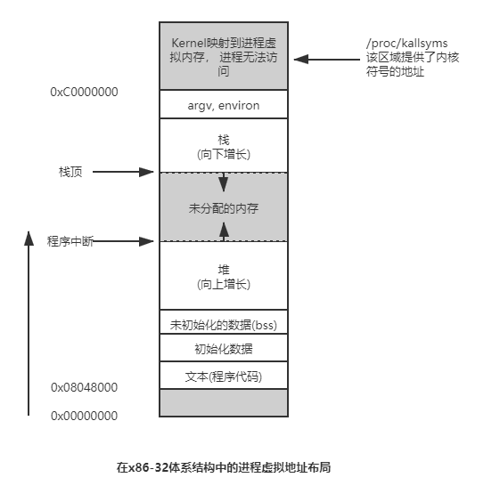
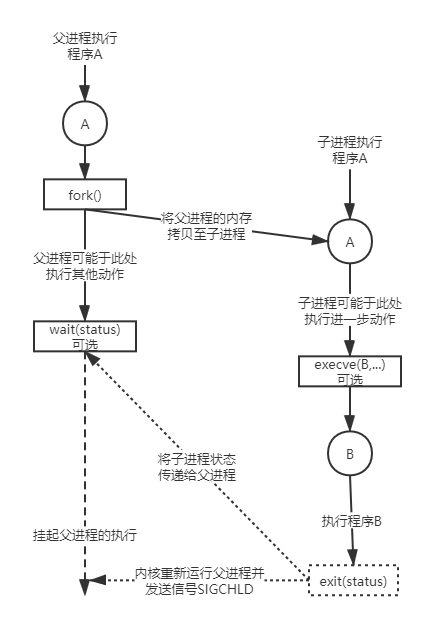

#  进程与虚拟内存

### 概述

进程是一个可执行程序的实例。

进程与程序的区别:  程序是包含了一系列信息的文件， 这些信息描述了如何在运行时创建一个进程， 所包含的内容如下:

- 二进制格式标识: 可执行文件格式的元信息(metainformation)。内核利用此信息来解释文件中其他信息。
- 机器语言指令: 对程序算法进行编码
- 程序入口地址: 标识程序开始执行时的起始指令位置。
- 数据: 程序文件包含的变量初始值和程序所使用的字面常量(比如字符串)
- 符号表及重定位表: 描述程序中函数与变量的位置与名称。用于调试和运行时的符号解析
- 共享库和动态连接信息: 列出程序运行所需要使用的共享库以及加载共享库的动态链接器的路径名

可以用一个程序来创建许多进程， 或反过来说， 许多进程运行的可以是同意程序。

进程是由内核定义的抽象实体， 并为该实体分配用以执行程序的系统资源。从内核角度看， 进程由内存空间和一系列内核数据结构组成， 其中用户内存空间包含了程序代码及代码所使用的变量， 而内核数据用于维护进程状态信息。

### 进程内存布局



每个进程所分配的内存由许多部分组成， 通常称之为"段"。 如下所示:

- 文本段：包含进程运行程序的机器语言指令。 文本段具有**只读**属性，防止进程通过错误指针修改。 **因为多个进程可同时运行同一程序**。一份程序代码拷贝可以映射到所有这些进程的虚拟地址空间中。
- 初始化数据段：包含显示初始化的全局变量和静态变量。当程序加载到内存时， 从可执行文件中读取这些值。
- 未初始化数据段：包含未显示初始化的全局变量和静态变量。程序启动后， 系统为本段内所有内存初始化为0. 通常称为**BSS段**。 之所以与初始化数据段区分， 由于程序在磁盘上存储时，**没有必要为未经初始化的变量分配存储空间**。只需记录其位置与所需大小。
- 栈：一个动态增长和收缩的段， 由栈帧组成。 系统会为每个当前调用的函数分配一个栈帧。 其中存储了函数的局部变量、实参与返回值。
- 堆：是在可运行时动态进行内存分配的一块区域。堆顶称作**program break**。

可使用`size`命令查看二进制可执行文件的文本段、初始化数据段、非初始化数据段的大小。


### 虚拟内存管理

Linux 内核也采用了虚拟内存管理技术。该技术利用了大多数程序的一个典型特征， 即访问局部性， 以求高效使用CPU和RAM。多数程序展现了两种类型局部性:

- 空间局部性：程序倾向访问在最近访问过的内存地址附近的内存。
- 时间局部性：程序倾向在不久的将来再次访问最近刚访问过的内存地址。（如循环）

正是**由于访问局部性特征， 程序即使只有部分地址在RAM中仍可以执行。**

> 虚拟内存的规划之一是将每个程序使用的内存分割成小型的、固定大小的“页”(page)单元。将RAM划分为成一系列与虚拟内存尺寸相同的页帧。 任一时刻， 每个程序仅有部分页驻留在物理内存页帧中。 这些页构成了所谓驻留集。程序未使用的页拷贝保存在交换区(swap area，这是磁盘空间中的保留区域， 作为计算机RAM的补充)内，需要时会被载入物理内存。若进程欲访问的页面并不在物理内存中， 将会发生页面错误(page fault), 内核即刻挂起进程的执行， 同时从磁盘中将该页面载入内存。

在x86-32 CPU架构中页面大小为4kb, 而Alpha的页面大小为8kb。

所以， 内核需要为每个进程维护一张页表(page table)。 描述了每页虚拟地址空间(virtual address space)中的位置。页表中每个条目要么指出一个虚拟页面在RAM中所在位置， 要么表面其驻留在磁盘（交换区）上。

在进程的虚拟地址空间中， 并非所有的地址范围都需要页表条目。可能存在某些地址空间暂未被使用，故而无需为其分配页表条目。 若进程试图访问的地址并无页表条目与之对应， 那么进程将收到一个SIGSEGV信号。

并且进程的有效虚拟地址范围在其生命周期中可能发生变化。当发生如下场景时:

- 栈增长
- 堆内存动态变化
- 连接共享内存区时
- 当创建内存映射时

> 虚拟内存的实现需要硬件中分页内存管理单元(PMMU)的支持。 PMMU将要访问的每个虚拟内存地址转换成对应的物理内存地址。 当特定虚拟内存地址所对应的页没有驻留在RAM中时， 将以页面错误通知内核。

虚拟内存管理使进程的虚拟地址空间与RAM物理地址空间相隔离，带来如下优点:

- 进程之间、进程与内核之间相互隔离。所以进程无法修改读取彼此的内存。

- 要想实现多进程内存共享。某些系统调用可使多个进程的页表指向相同的RAM页(如mmap、shmget)。

  同时执行同一程序的多个进程， 可共享一份只读程序代码副本。

- 便于实现内存保护机制。 可以对页表条目进行权限标记， 标记其为可读、可写、可执行等。多进程共享RAM页时访问权限亦将多样。

- 进程所占用的内存(即虚拟内存大小)可超出RAM容量。 因为进程虚拟内存地址仅仅部分驻留在物理内存当众。

- 提高了CPU利用率。 任意时刻CPU可执行多个进程。因每个进程使用的RAM减少了，RAM中同时容纳的进程数量增多了。


### 进程的创建、退出、等待



- 创建新进程

```c
#include <unistd.h>

/*
此方法返回两次，
在父进程中返回创建子进程的id，如果失败则返回-1。
对于子进程总是返回0
*/
pid_t fork(void);
```

调用fork后将会存在两个进程， 并都会从fork返回处继续执行。两个进程将执行相同文本段， 拥有不同的栈段、数据段及堆段并互不影响。

可根据返回值区分是父进程还是子进程， 当返回0时，为子进程。当返回大于0的值为父进程。 当返回-1时表示创建进程失败。

执行fork时， 子进程会获得父进程所有文件描述符副本。 意味着父子进程中对应的描述符均指向相同打开文件句柄。

#### fork的内存语义

