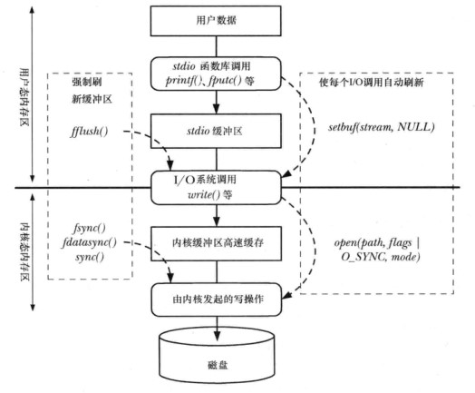

# I/O 缓冲

## 目录

- [I/O 缓冲](#io-缓冲)
  - [目录](#目录)
  - [概述](#概述)
  - [用户态stdio库的缓冲](#用户态stdio库的缓冲)
    - [设置stdio流的缓冲模式](#设置stdio流的缓冲模式)
  - [内核态控制文件I/O的内核缓冲](#内核态控制文件io的内核缓冲)
    - [fsync](#fsync)
    - [fdatasync](#fdatasync)
    - [sync](#sync)
    - [O_SYNC标志](#o_sync标志)
  - [direct I/O: 不缓存直接I/O](#direct-io-不缓存直接io)
  - [stdio库函数与系统调用文件描述符的转换](#stdio库函数与系统调用文件描述符的转换)


## 概述

系统I/O调用和标准C语言库I/O函数(stdio)在操作磁盘文件时会对数据进行缓存。而不会直接操作磁盘文件，通过与缓冲数据交互，直到特殊字符或缓冲满时才会与文件进行交互。
系统调用read()和write()操作磁盘文件时都不会直接进行访问， 而是在用户空间缓冲区与内核缓冲区高速缓存之间复制数据。

> Linux 内核对缓冲区高速缓存的大小没有固定上限。内核会分配尽可能多的缓冲区高速缓存页，仅受限于物理内存总量。

如果与文件发生大量的数据传输， 通过采用大块空间缓冲数据，以及执行更少的系统调用， 可极大提高I/O性能。实际表现查看源码[syscall_io.c](syscall_io.c)

下图展示了用户态和内核态缓冲情况:



## 用户态stdio库的缓冲

C语言I/O函数实现了当操作磁盘文件时， 缓冲大块数据以减少系统调用。 如: `fprintf、fscanf、fgets、fputs、fputc、fgetc` 

### 设置stdio流的缓冲模式

调用`setvbuf`可控制stdio库使用缓冲的形式。

```c
#include <stdio.h>

// 返回0表示成功， 否则失败
int setvbuf(FILE * stream, char* buf, int mode, size_t size);
```

**缓冲模式**

- _IONBF：不缓冲。每个stdio库函数立即调用`write()` 或 `read()`， 并忽略`buf` 与`size` 参数。 `stderr` 属于这一类型。
- _IOLBF：行缓冲。终端设备流属于这一类型。对于输出流，除非遇到换行符或缓冲区满了，否则将对数据缓冲。对于输入流， 每次读取一行数据。
- _IOFBF：全缓冲。磁盘的流默认采用此类型。 实际的读写系统调用数据大小与缓冲区相等。 

其他类`setvbuf` 接口如下:

- **setbuf**: 构建在setvbuf之上，相当于 setvbuf(fp, buf, (buf == NULL)? _IONBF: _IOFBF, BUFSIZE)
- **setbuffer**: 类似setvbuf,  相当于 setvbuf(fp, buf, (buf == NULL)? _IONBF: _IOFBF, size)

**刷新缓冲区**
无论采用何种缓冲模式， 都可使用`fflush` 强制刷新到内核缓冲区中。

```c
#include <stdio.h>

// 返回0则成功， 否则发生错误
int fflush(FILE *stream);
```

当`stream` 为NULL时， fflush将刷新所有缓冲区。fflush同时可应用与输入流。关闭相应流时，将自动刷新其stdio缓冲区。


## 内核态控制文件I/O的内核缓冲

**Synchronized I/O data integrity completion状态**旨在确保针对文件的一次更新传递了足够的信息(到磁盘), 以便于之后对数据的获取。主要存在两种状态:

- 对于读操作，意味这被请求的文件数据已(从磁盘)传递给进程。在这之前凡是存在影响所请求数据的挂起写操作，都将写入到磁盘。
- 对于写操作，意味着写请求所指定的数据已传递(到磁盘)完毕， 且对应元数据也传递到磁盘完毕。针对元数据通常只传递文件大小(如果发生改变)， 而时间戳不一定会传递到磁盘。

**Synchronized I/O file integrity completion状态**是**Synchronized I/O data integrity completion状态**的超集。此状态将所有发生改变的文件元数据都传递到磁盘上。

强制刷新内核缓冲区到文件是可能的。内核提供了如下方式:
- fsync： 使处于Synchronized I/O file integrity completion状态
- fdatasync： 使处于Synchronized I/O data integrity completion状态
- sync: 所有文件相关数据都同步
- O_SYNC标志： 使处于Synchronized I/O file integrity completion状态
- O_DIRECT: 不缓冲

### fsync
系统调用`fsync()` 将使缓冲数据与打开文件描述符fd相关所有元数据刷新到磁盘上。调用`fsync()` 会强制使文件处于**Synchronized I/O file integrity completion状态**。
```c
#include <unistd.h>

// 返回0则成功， -1则发生错误
int fsync(int fd);
```

`fsync()`调用只有在同步传递完成后才返回。

### fdatasync
`fdatasync()`系统调用类似`fsync()` ，只是强调文件处于**Synchronized I/O data integrity completion状态**

```c
#include <unistd.h>

// 返回0则成功， -1则发生错误
int fdatasync(int fd);
```

`fdatasync()`可能减少对磁盘的操作次数。因为`fdatasync()`仅仅要求数据更新， 而`fsync()`不仅是数据更新， 其元数据(如文件大小)亦需更新。

### sync
`sync`系统调用会使包含更新文件信息的所有内核缓冲区(即数据块、指针块、元数据等)刷新到磁盘。

```c
#include <unistd.h>

// 同步完成才返回
void sync(void);
```

### O_SYNC标志
调用open()指定O_SYNC标志， 则会使后续的输出保持**Synchronized I/O file integrity completion状态**。
其他标志`O_DSYNC`与`O_RSYNC`则分别使文件保存**Synchronized I/O data integrity completion状态**与**Synchronized I/O file integrity completion状态**。

但在Linux 2.6.3中才实现了O_DSYNC， 而O_RSYNC可能在未来的版本中实现。

## direct I/O: 不缓存直接I/O
标志位`O_DIRECT` 用于直接I/O, 并非所有Linux文件系统和内核版本都支持该标志。 若open()使用该标志返回**EINVAL**则不支持。

直接I/O需要对齐限制， 否则将导致**EINVAL**错误:
- 用于传递数据的缓冲区， 其内存边界必须对齐位块大小的整数倍
- 文件和设备的偏移量， 必须使块大小的整数倍。
- 待传递数据的长度必须使块大小的整数倍。


## stdio库函数与系统调用文件描述符的转换
```c
#include <stdio.h>

// 返回文件描述符则成功， -1则发生错误
int fileno(FILE* stream);

// 返回文件指针则成功， NULL则发生错误
FILE* fdopen(int fd, const char* mode);
```