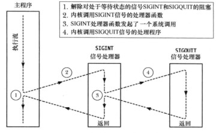

# 信号

## 目录

- [信号](#信号)
  - [目录](#目录)
  - [概述](#概述)
  - [信号类型](#信号类型)
  - [信号处理](#信号处理)
    - [signal()](#signal)
    - [sigaction()](#sigaction)
  - [发送信号](#发送信号)
  - [信号集操作](#信号集操作)
  - [阻塞信号及信号排队处理](#阻塞信号及信号排队处理)
    - [阻塞信号](#阻塞信号)
    - [等待状态的信号及其排队处理](#等待状态的信号及其排队处理)
  - [等待信号](#等待信号)
    - [pause()](#pause)
    - [sigsuspend()](#sigsuspend)
    - [同步等待信号](#同步等待信号)
  - [信号与线程](#信号与线程)
    - [可重入和非可重入函数](#可重入和非可重入函数)
    - [信号处理器函数内部对errno的使用](#信号处理器函数内部对errno的使用)
    - [全局变量与sig_atomic_t数据类型](#全局变量与sig_atomic_t数据类型)
  - [终止信号处理](#终止信号处理)
  - [在备选栈中处理信号: sigaltstack()](#在备选栈中处理信号-sigaltstack)
  - [系统调用的中断和重启](#系统调用的中断和重启)
    - [为信号修改SA_RESTART标志](#为信号修改sa_restart标志)
  - [核心转储文件](#核心转储文件)
  - [信号特殊处理的情况](#信号特殊处理的情况)
  - [硬件产生的信号](#硬件产生的信号)
  - [信号传递的时机与顺序](#信号传递的时机与顺序)
    - [同步信号与异步信号](#同步信号与异步信号)
    - [何时传递一个信号？](#何时传递一个信号)
    - [解除对多个信号的阻塞时， 信号的传递顺序](#解除对多个信号的阻塞时-信号的传递顺序)
  - [实时信号](#实时信号)
    - [排队实时信号存在数量限制](#排队实时信号存在数量限制)
    - [发送实时信号](#发送实时信号)
    - [处理实时信号](#处理实时信号)
  - [通过文件描述符获取信号](#通过文件描述符获取信号)


## 概述

信号是事件发生时对进程的通知机制。有时也称之为软件中断。信号与硬件中断相似之处在于打断了程序执行的正常流程。大多数情况下， 无法预测信号到达的精确时间。

进程可向其他进程发送信号， 亦可向自身发送信号。然而发往进程的诸多信号， 通常源于内核。 引发内核为进程产生信号的事件通常有:

- 硬件异常。如被0除、引用了无法访问的内存区域。
- 键盘输入中断。 如输入中断字符(Ctrl + C)、暂停字符(Ctrl + Z)
- 发生了软件事件。如定时器到期、文件描述符输出变有效等

信号分为两大类:

- 标准信号， Linux对标准信号的编号为1~31
- 实时信号

针对每个信号都有唯一的整数表示， 从1开始, 最大**NSIG**-1。 以SIGxxxx形式定义在文件<signal.h>中。其值因系统而异。 

信号因某些事件产生。 然后被传递给某一进程， 进程会对之作出响应。 在产生和到达期间，信号处于等待(pending)状态。 通常一旦内核要调度该进程运行， 等待信号会马上送达。

有时需要确保一段代码不为传递来的信号所中断， 需将信号添加到进程的信号掩码中。此时信号将会被阻塞， 进入等待状态， 直到其从信号掩码中移除为止。进程可使用各种系统调用对其信号掩码添加和移除信号。


信号到达后， 因不同信号有如下默认操作之一:

- 忽略信号: 内核将信号丢弃
- 终止进程: 异常终止， 而非exit() 正常退出
- 产生核心转储文件， 同时终止进程: 核心转储文件包含对进程的虚拟内存的镜像， 可将其加载到调试器中以检测进程终止时的状态。
- 停止进程: 暂停进程
- 恢复暂停进程

除了上述默认行为之外， 程序也能改变信号到达时的响应行为， 可有如下响应：

- 采取默认行为
- 忽略信号
- 执行信号处理程序


## 信号类型

| 名称      | 描述                                                         | 默认   |
| --------- | ------------------------------------------------------------ | ------ |
| SIGABRT   | 中止进程,产生核心转储文件。 这实现了abort()预期的目标， 产生核心转储文件用于调试。 | core   |
| SIGALRM   | 实时定时器过期                                               | term   |
| SIGBUS    | 内存访问错误                                                 | core   |
| SIGCHLD   | 当某一子进程终止时将向父进程发送该信号；或某一子进程因信号停止或恢复时， 有可能会向父进程发送该信号。 | ignore |
| SIGCONT   | 若停止则继续                                                 | cont   |
| SIGEMT    | 硬件错误                                                     | term   |
| SIGFPE    | 算术异常                                                     | core   |
| SIGHUP    | 挂起                                                         | term   |
| SIGILL    | 非法指令                                                     | core   |
| SIGINT    | 终端中断(Control+C)                                          | term   |
| SIGIO     | 利用fcntl()系统调用， 即可与特定类型(终端和套接字)的可打开文件描述符发生I/O时产生该信号。 | term   |
| SIGPOLL   | 从System V派生而来， 与Linux中的SIGIO信号同义                |        |
| SIGKILL   | 确保杀死                                                     | term   |
| SIGPIPE   | 当某一进程试图向管道、FIFO或套接字写入信息时， 如果这些设备并未响应的读取进程。 系统产生此信号。 | term   |
| SIGPROF   | 性能分析定时器国企                                           | term   |
| SIGPWR    | 电量行将耗尽                                                 | term   |
| SIGQUIT   | 终端退出， Control+\                                         | core   |
| SIGSEGV   | 无效的内存引用， 通常为段错误                                | core   |
| SIGSTKFLT | 协处理器栈错误                                               | term   |
| SIGSTOP   | 确保停止                                                     | stop   |
| SIGSYS    | 无效的系统调用                                               | core   |
| SIGTERM   | 终止进程， kill和killall命令所发送的默认信号。               | term   |
| SIGTRAP   | 跟踪/断点陷阱                                                | core   |
| SIGTSTP   | 终端停止                                                     | stop   |
| SIGTTIN   | BG从终端中读取                                               | stop   |
| SIGTTOU   | BG向终端写入                                                 | stop   |
| SIGURG    | 系统发送毅哥信号给进程， 表示套接字上存在带外(紧急)数据      | ignore |
| SIGUSR1   | 用户自定义信号1                                              | term   |
| SIGUSR2   | 用户自定义信号2                                              | term   |
| SIGVTALRM | 虚拟定时器过期                                               | term   |
| SIGWINCH  | 终端窗口尺寸变换                                             | ignore |
| SIGXCPU   | 突破对CPU时间限制                                            | core   |
| SIGXFSZ   | 突破对文件大小的限制                                         | core   |

## 信号处理
UNIX提供了`signal()`和`sigaction()`来改变信号处置。signal的行为在不同的UNIX实现间存在差异， 因此考虑可移植性， **sigaction()是建立信号处理器的首选API**。

其次， 不推荐使用`signal()`的理由:
- 会在进入信号处理函数时，将信号处置重置为默认行为(**SA_RESETHAND**)。 
- 在信号处理器执行期间， 不会对新产生的信号进行阻塞。如果同类信号在执行期间再度进入， 将会导致递归调用(**SA_NODEFER**)。
- 在某些实现中， 存在不对系统调用重启功能(**SA_RESTART**)

### signal()

```c++
#include <signal.h>

// 若成功返回上一个信号处理函数， 否则返回SIG_ERR
void (*signal(int sig, void(*handler)(int)))(int);
```

在调用signal() 时， 可使用如下值来代替函数地址:

- SIG_DEL：将信号重置为默认处理程序
- SIG_IGN：忽略该信号

### sigaction()
改变信号处置的另一个系统调用是`sigaction()`, 相较signal()更具灵活性。可获取更多信息、实施更多控制。

```c
#include <signal.h>

/**
 * \brief 对指定信号进行处理器设置及其他控制
 * \param sig 指定进行处理的信号
 * \param act 指定对信号的处置控制
 * \param oldact 返回指定信号已有的处理
 * \return 0 表示成功， -1 则失败
 */
int sigaction(int sig, const struct sigaction* act, struct sigaction* oldact);

// struct sigaction 定义如下:
struct sigaction
{
	/* Signal handler.  */
#ifdef __USE_POSIX199309
	union
	{
		/* Used if SA_SIGINFO is not set.  */
		__sighandler_t sa_handler;
		/* Used if SA_SIGINFO is set.  */
		void (*sa_sigaction) (int, siginfo_t*, void*);
	}
	__sigaction_handler;
# define sa_handler	__sigaction_handler.sa_handler
# define sa_sigaction	__sigaction_handler.sa_sigaction
#else
	__sighandler_t sa_handler;
#endif
	__sigset_t sa_mask;
	int sa_flags;
	void (*sa_restorer) (void);
};
```

上述结构体sigaction中的sa_handler 与 sa_sigaction都是信号处理的函数指针地址， 区别在于sa_sigaction将提供更多信息到信号处理当中。 同时sa_handler可指定为**SIG_IGN、SIG_DEL**之一，仅当sa_handler未指定前述的两个宏时， 参数sa_mask和sa_flags才有效。 最后一个参数sa_restorer不能用于应用程序， 此函数指针主要供内核使用，用于信号处理调用完后的恢复工作。

**sa_mask**用于指定一组信号掩码， 在此掩码中的信号会在执行信号处理程序时被阻塞在等待信号集中，在信号处理程序执行完毕后，会被移除阻塞集合。主要**用于避免指定的信号中断当前信号处理程序的执行**。 同时，**指定的sig会自动将加入到信号掩码中**， 避免信号处理程序执行过程中信号再此抵达而被中断。如[等待状态的信号及其排队处理](#等待状态的信号及其排队处理) 所述， 被阻塞的信号被移除阻塞列表后，只会被触发一次。

sa_flgs字段是一个位掩码， 可选值如下:

- SA_NOCLDSTOP：若sig指定为SIGCHLD时， 则被信号停止或恢复的子进程将不会产生该信号。
- SA_NOCLDWAIT：若sig为SIGCHLD时，子进程终止不会转化为僵尸进程
- SA_NODEFER：捕获sig信号时， 不会自动将sig信号添加到阻塞掩码中
- SA_ONSTACK：当调用指定的信号处理函数时， 使用sigaltstack()安装备选栈
- SA_RESETHAND：捕获sig信号时，在执行信号处理前会将信号处理重置为默认(SIG_DEL)，即指定的信号处理为一次性的。
- SA_RESTART：自动重启有信号处理器程序中断的系统调用
- SA_SIGINFO：调用信号处理器程序时携带了额外参数。信号处理函数指针为`sa_sigaction`


如下设置终端中断处理程序:

```c++
#include <stdio.h>
#include <signal.h>

void sign_interrupt_handler(int signno)
{
    printf("Trigger the SIGINT(%d) signal.\n", signno);
}

int main(int argc, char const *argv[])
{
    // 关闭缓冲
    setbuf(stdout, NULL);
    void (*oldHandler) (int) = signal(SIGINT, sign_interrupt_handler);
    if (oldHandler == SIG_ERR){
        printf("Failed to set SIGINT signal handler.\n");
        return 1;
    }

    printf("Please enter Ctrl+C to trigger the interrupt handler.\n");
    while (1);
    return 0;
}
```

下图为信号到达及处理过程:

<img src="data:image/png;base64,iVBORw0KGgoAAAANSUhEUgAAAiQAAAEFCAYAAADT6/x+AAAIGXRFWHRteGZpbGUAJTNDbXhmaWxlJTIwaG9zdCUzRCUyMkVsZWN0cm9uJTIyJTIwbW9kaWZpZWQlM0QlMjIyMDIxLTA1LTI0VDA5JTNBNDAlM0EwMC44NzlaJTIyJTIwYWdlbnQlM0QlMjI1LjAlMjAoV2luZG93cyUyME5UJTIwMTAuMCUzQiUyMFdpbjY0JTNCJTIweDY0KSUyMEFwcGxlV2ViS2l0JTJGNTM3LjM2JTIwKEtIVE1MJTJDJTIwbGlrZSUyMEdlY2tvKSUyMGRyYXcuaW8lMkYxMy45LjklMjBDaHJvbWUlMkY4NS4wLjQxODMuMTIxJTIwRWxlY3Ryb24lMkYxMC4xLjUlMjBTYWZhcmklMkY1MzcuMzYlMjIlMjBldGFnJTNEJTIyTGtUVTh6T1AzTTBESlRQcUpaT3ElMjIlMjB2ZXJzaW9uJTNEJTIyMTMuOS45JTIyJTIwdHlwZSUzRCUyMmRldmljZSUyMiUzRSUzQ2RpYWdyYW0lMjBpZCUzRCUyMmlXY2g0UndEc2pmLWJ3LWJJUk1lJTIyJTIwbmFtZSUzRCUyMlBhZ2UtMSUyMiUzRTdWcHRiNXM2RlA0MWxyb1Bkd0xNaSUyRk1SOHRKcDBxUkoxZFcyanl4NHhCckJFVGhMdWw5JTJGYmJBaDJFNmhWMG1xcnBPcTFqNSUyQkFaN25uT1BuUUFHY2I0JTJGM1ZicmJmS0laTG9EblpFY0FGOER6WEFlRiUyRkklMkJ3UExZVzVFaERYcEZNVHVvTkQlMkJRM1ZpdWxkVTh5WEE4bU1rb0xSblpENDVxV0pWNnpnUzJ0S25vWVR2dEJpJTJCRlZkMm1PRGNQRE9pMU02eGVTc1kxOGlzRHA3Ujh3eVRmcXlxNGpSN2FwbWl3TjlTYk42T0hFQkpjQXppdEtXZHZhSHVlNEVPQXBYTnAxcXpPajNZMVZ1R1JURm53OSUyRlBUemY1MVA5MlQzc1NoTG1PM3VWJTJGJTJGQWRwZGZhYkdYRHl4dmxqMHFCQ3E2THpNc05uRUJUQTRid3ZERExsMkwwUVBubk5zMmJGdklZYmtkcmhnJTJCbnIxUHQzdDY3amFZYmpHckh2a1V0U0NVZ0VtUDhWVCUyRjBPUGZ6ZG1jWU44aG5Vck84Mjd2SGhiZWtNZzhBeVhmUkdrWmdSZ0JsSUJsQUpJWW9GWFRtQVBraUVZY2lTRWRTWTRKRzhKVnM0ciUyQnhITmEwSXBiU2xyeW1ja1BVaFNhS1MxSVh2THVtbU9JdVQwUkNCUHVwYkVjMkpJc0U1ZXg4dE16NkZ5SUlxUlJGSmtVQlRhR3JrV1E2NDc3Y2M1aDJKMTllSmslMkYwdTlxdXZOY1VMelpFQlRvV0JCd2cydEJnTVlSd0dVV2k1UW9IS2xJNjVxc2g5NllwZldtQyUyRlIyTmM2TTlOamo4UVFWSmtvanJxRnNGUzVTUm40Tkwyb0RTMTdoTXlYOGR2b3BOZDFYYXl5dHA5bFFUWlRzUkJvUExLMXl6SXgxRFJYZFUlMkZ4JTJGZG1adm01M3U4QiUyQnVtRXFXRVRWWFpzdjFETHJ3a2JDN2QyOG5wZnYlMkJTNmQweTZINzNKQ1pFQ1ZLVXpZT05TYVViaDQzeDJIY3FKTkZUMTZqY2FSSWRyV053aHZIVldCd2V1ZnlvT0theVFmSkNzU3VFRTljU3lWUjAwQWc0VVA4OTFMOGpNZmU5SmlxY0UxJTJCeThOZVJOQk9QSElEUXBDQVlDSDIyak5hdCUyQlhJaFlTdHpxSWx3dEJOSXl3Y2o3QmJpMzglMkZPQ09peHNTJTJGNjE4TnBzaUVTYmdyZDh2RVVnYThkaSUyRjFWSkFxYlE5ZiUyQmlDd0tGdHJ1b2g5Z0h6QkNCZmlLUHdEcWZHUlJvMmw3SnJka2hxMThWTVpoRlVrTGZPelF1WlU0SktLVjJDRUNwd1B1R2E2NXJXSXFBdUEybVVZbFhGY1M4YXg1V1gzZXJDYTh0T0FkVXo2Q0wzNlZmam0lMkIwRDJ2cDJNTEk3U2Jadk9vJTJCcVUlMkZPN2JSVENNbE9GYlkwQmVvQXo5NHFZM1dQMFpWNFNESUdMblJKbE9VV0N0aHBuZ2JLTlM3ZVR0Mmd0b05haSUyRkczbDIwYU9pSFdvYndkdUtOVyUyRkN1OEZMQ2ZDWElzdlhOWmxlYUU0bVM5OEl1YmNsNndMVlVwOHlmQUZZbHpTYzk1NGJQWjA0ZUVlUCUyRkpOa0VrUm9tRXc4QlA4bWswbiUyQnFiOVQxQXUycWY2cFp5VTRnN2YxVDB2bDU3V1ZYeURFR2xjMnl4REVqcERWUXR3bElJYWk4dU1TajRzNFVRS3V3T3hVYmplbElYY2pJZmQ4WWZUQ1FpaUc3eFZ2NWFMMVJrVWk5RFNtYlJVVXRMaXNmcnhjVHM2WWRlWWRiTG5ueE0lMkZFeDVLV2FUU2Z4Sm1GYWZOalRPZERrZkFxbFkxZk1hOUdLZ2dDazFmM3ByemFDdU0yVW4zQkJJJTJGWDJldCUyRmE2T2Y3TDVueHBOdmdmMTYxWUZaRDklMkY1YlRpZENRTzBsQzhzNG9VSXVWbllOQ0tBUEpETWJPRVVpb0NKUFJWN0MwdWd2blphb2FhdWZWdlpkNkZ3NHQzJTJCTTM5N292YiUyRkxBR1glMkZ3RSUzRCUzQyUyRmRpYWdyYW0lM0UlM0MlMkZteGZpbGUlM0WFetqlAAAgAElEQVR4Xu19C5RV1ZnmpyUlxSsUVTgx2gxJRGXFgWlN97RBh8So9Ki0Aok4AYmEAGJ8jAYjhpfyMNgSnaBBBYk2jwzYLWhQRkyCstTR5agzMGZ8E8bGJoEqKUEelpbM+q5n05vDufeee+85Z59z73fWckndux///v5d+3z1v/ZR0CMEhIAQEAJCQAgIAccIHOV4fk0vBISAEBACQkAICAGIkGgTCAEhIASEgBAQAs4RECFxrgIJIASEgBAQAkJACIiQaA8IASEgBISAEBACzhEQIXGuAgkgBISAEBACQkAIiJBoDwgBISAEhIAQEALOERAhca4CCSAEhIAQEAJCQAiIkGgPCAEhIASEgBAQAs4RECFxrgIJIASEgBAQAkJACIiQaA+4RGAQgHMAzC4ixHQAbHsvgEcD2o4GsCLg8wYAdwFYBuB5lwvV3EJACAgBIVAYARES7RDXCIzyBPATiiaPZAwBYAgHSUlfH/mw+58CYBWAgSEWdZZISgiU1EQICAEhkBACIiQJAa1pcgjQ0jErBBb3A7gewH4ANuEIQ0jGAZjp9Q0xlZoIASEgBIRAGhAQIUmDFmpXBrpUJgNYCKDVBwPJx3PWZ+tDuGxoISEh+TWAhwpYSmQdqd09p5ULASGQUgRESFKqmBoRqxAhIQQmBuRvAIwE8GYRXAwhMRYSun32edYSQ3BERmpkc2mZQkAIZAsBEZJs6avapC1GSEgw6LoxRIQ/TwwAgdYTunaaAVzgBbKy2QQAV3mWkhkhgmerDV+tRwgIASGQGQRESDKjqqoQ1O+GybcoY8U4D8BpAHYA+AjAGx45oeVjLoCpPlePsZAMAMBg2HzPppAWl6oAXYsQAkJACGQBARGSLGipemUsZCEh6RjuuVyIALNwaAVZHgCHsX4EBb1yjlsBLPHIjN+tU73oamVCQAgIgQwhIEKSIWVVoaiFCAmJA7//mrduOy04n4WEhGWrL53XT0iY6bNBKb9VuJu0JCEgBDKNgAhJptWXeeGLxZBwgUF1SoIIST6S4ickmQdNCxACQkAIVCMCIiTVqNV0rqmUomVcgYkjMYSElg87Ddi/ykkA9lhF0+zCaibo1Z9anE6kJJUQEAJCoAYRECGpQaVryUJACAgBISAE0oaACEnaNCJ5hIAQEAJCQAjUIAIiJDWodC1ZCAgBISAEhEDaEBAhSZtGJI8QEAJCQAgIgRpEQISkBpWuJQsBISAEhIAQSBsCIiRp04jkEQJCQAgIASFQgwiIkNSg0rVkISAEhIAQEAJpQ0CEJG0akTxCQAgIASEgBGoQARGSGlS6liwEhIAQEAJCIG0IiJCkTSOSRwgIASEgBIRADSIgQlKDSteShYAQEAJCQAikDQERkrRpRPIIASEgBISAEKhBBERIalDpWrIQEAJCQAgIgbQhIEKSNo1IHiEgBISAEBACNYiACEl2lf5tAGc2NTWd/dlnn/U7cOBA7/b29oaOjo667C5JkhOBurq6jvr6+v2dO3feefTRR7/d2tr6LIAXAPxeCAkBISAEqhUBEZJsaXZoU1PThN27d5/fv3//feeff363M84445iTTz4ZJ554Inr27In6+vpsrUjSHoFAe3s72trasG3bNrz11lt45ZVXPn3qqac+ev3117v06NHjqdbW1kUA1go6ISAEhEA1ISBCkg1tTuzZs+e0Pn36dJs0aVLP4cOH47jjjsuG5JIyMgR27NiB1atX495772177733Pmpra5sD4P7IJtBAQkAICAGHCIiQOAQ/xNRDGxsbfzFgwIDGGTNm9DznnHNCdFGTWkBgw4YNmDVrVtvmzZt37dq16zpZTGpB61qjEKhuBERIUqrfHj16PNi1a9cRd999d/cRI0akVEqJ5RqBRx55BNdcc82evXv3PrJ79+6xruXR/EJACAiBchEQISkXufj69W9qanrsoosuOmHRokVdFBMSH9DVMjJjTiZMmLDv8ccff7+1tfViAK9Xy9q0DiEgBGoHARGSdOn67IaGhnXz5s3rdu2116ZLMkmTegQWLFiAKVOmfLR///4LADAzR48QEAJCIDMIiJCkR1Vnd+rU6XdLly6tv+yyy9IjlSTJFAIrV67EmDFj2j/55JNzRUoypToJKwRqHgERknRsgf4NDQ0v/epXv+omMpIOhWRZCpKSH/zgB7SU/LXcN1nWpGQXArWFgAhJCvTd1NT01owZM/rJTZMCZVSJCHTfzJo1i0XVTq6SJWkZQkAIVDkCIiSOFcxsmmHDhl360EMPdXEsiqavMgSuuOKKfWvWrHlY2TdVplgtRwhUKQIiJG4VO/T4449fsXXr1u7KpnGriGqcndk3ffv23bN9+/ZRqlNSjRrWmoRAdSEgQuJQn42NjVsWL178ZdUZcaiEKp+adUrGjx//x127dn2lypeq5QkBIZBxBERI3Clw4uDBg+c988wzPd2JoJlrAYFvfvObbRs3bpyiMvO1oG2tUQhkFwEREke669mz5z8/8sgjJ6ocvCMF1NC0LDM/YsSIbW1tbX9RQ8vWUoWAEMgYAiIkbhQ2dMCAAUs3bdoUqXXkzTffxMiRI3HVVVfh1Vdfxf33H37v2pAhQ7BixQo0NTUdsernn38ey5Ytw1133YWGhobDvud3Z511ViiknnvuOQwaNAjss3XrVowaxfCFz5/9+/dj5syZGDduHE455ZRQ46lRNAgMHDiQ996MUSxJNHhqFGcI8HC6FcASAG8C4M93AVgG4PkAqXgALS8g7QwAs63vBwHoC2CF7zNeJOZv95zVZqX376AiUv45pgPgPPcCeDRAttG++U2TYmt1ppSoJhYhiQrJEsZpampaO2fOnIuuvPLKEnrlb0qSMXr0aBjC0aVLF8yfPz9HTAz5aG1txdSpUzF37tzcZ7Nnz8aMGfw9KfxMnDjxMJJCwnLBBRccIhQcd+HChZg8efJhRIYy8bEJSRBJKTa/vo8Ggfvuuw/Tpk17vLW1dWg0I2oUIeAEAf4lMw7AAABDCkjAv6BIUEhItuYhKyQFfqJxPYB1Htkxwwe1M9+Z9u9ZRKkFwFUA5gM43ZtjoUcyKLMhHEHkx/wFxwOUa10FYGAIpM16QzRNbxMREge66dSp08fbtm2rP+644yKb3SYcYQkJ3UW0ZpTylEJI+vbte2h8m7hwPllKSkG98rY7duzAiSeeyAqux1Y+mkYQAs4QoHVhQx6CESRUKRYSY4GYaA1kTMN+4hJESGipsfuaNraFxCYcYQgJyddMGpidIZ7gxCIkCYLtTfXtAQMG/FNU7hq6Qa6//vrD3DN01RRz2dBCQkLC+IJ8lhK/dYTyFyMkJB60iqxfv/4QssuXLwdfiLZlhe6lJUuW4NZbbz3CRZS8SmpjRs9t8x0Av6+NFWuVVYYAX+AkJHypnwrAdpnYS7VdHqVYSGiR4D1QJBZ8jPWj2ZuLPnB+ZpODsBYSkihbXh6QxVw2xhr0awAPFbCUVIV1hICLkCT/Gztt8uTJM++4445jopzaxHnMmjUL06fzd7bwYwgJLSQkNfv27cu5cgzBMeQj91vpIzyFRiaJue222/DLX/4y5zJ68sknsXbtWqxaRcvjkY+JOSkmr76vHIEbb7zx0/nz59P/Pqfy0TSCEEgUAQa+mbgOkozWGGY3BydjRWgtmQyArhaSH1pIDKkgAaBbxnan3AGgRxELibHA/A2AkT63UNByDCExFhJisM8jRCRnJDhVQ0ZESGLY0cWGbGpqWn/PPfecH/WdNYsWLcLTTz+Nb33rWzkRSAyCHloraMGwLR3btm3DjTfeCN6BMnDgwBx5yBd0WsxCwjlp/Vi3bl2OyPjb2zIVCqQthqO+Lx0B6vfqq69+qrW1tZDvvfSB1UMIxI8AX85nAPiqRRIKWUgYN5Lv+yBpGdDHsfnc7v1/OIDFXgCqcdmQFNwD4BaPUIS1kJDkcA1sz2BcPvw56KCm9YSki5YZ22IzwYtNYUyJP1A2fg0kMIMsJAmAbE/BYmi/+93vvnz66Yx1iuahm4SWiGeffRY33HADNm7cyGJYucGDgkv5OYnC9u3bcccdJPb5H9viEpQlExTUSqLBh2tkcO3YsWMxZ86ckrJ+okFGo9gI0I137rnnqkiatkVWEbCtFmEtJGH7mHgOYkMyw0wbEwwbJqjVkAz2J2kxQa22e+c8AKcB2AHgIwBveOSE7ecCmOqz/IQN4N0U0uKSer2LkCSsooaGhj1bt27tFmVA62OPPYbm5uZc2i6zaPj44zj4mbF+9OnT54gsHH5PIsGYEuPysd06/N6fqWM+82fZ2HEkJDTMwPEHsZLc+DOBElZFzU3HOJ6+ffvyFuDuNbd4LbgaELDJBa0H+TJQ7BgS49rIt35/XAjJwU0AtgO4z3KPFAtqpQuHLqUg6yPnoIWE1g66XHJ/K3pWkKCUZGP9CAp69ac9+906mdazCEnC6qurq/t03759dVHeXUNCcsYZZ+SsECat1ywryEKSL1XXJiRBQacca8uWLYfFqOQby5ASZtpQpttvv/2w+iMiJAlvPAC826ZLly4dHR0dkcYvJb8SzVijCPgJie3OMJDYWSzFYAp6mZs4j/etuiOFLCSMO5nlc6EEWUg4F8f+mkVIjHz5LCRBAbl+QlJq1lExTJx+L0KSPPwHDx48GPmsQdaLHA0PqAeSz43jt5DYQrIPXUL+wmlBhMSQEVpaWBxt06ZN2L17t1w2kWu99AGPOir3K6/f+9KhUw/3CERNSPjC5x1PpuCZHR/ydQCXe1aMIPeQsbwEZd7kc9kQwSDCFERI8pEUPyFxr5UIJdDBFCGYIYeKlZBMmzYtMF7DyMYqqV/60pdw3XXXHSqaZgqrsY0Jeg1DRtjGT0iC4kzyfSaXTcgdE2EzEZIIwdRQSSNQjsvGyBhUY8QEj5Jw0ILBQNWrrTgOk9njd8MExWwYS0k+TOxCbWxTLOh2EoA9VmaRLYstd9I6iHU+EZJY4Q0cPBZCkvwyNGMWERAhyaLWJLOHQNQWEgGbMgRESJJXiAhJ8phrRg8BERJtBSEgBNKKgAhJ8poRIUkec80oQqI9IASEQMoRECFJXkEiJMljrhlFSLQHhIAQSDkCIiTJK0iEJHnMNaMIifaAEBACKUdAhCR5BYmQJI+5ZhQh0R4QAkIg5QiIkCSvIBGS5DHXjCIk2gNCQAikHAERkuQVJEKSPOaaUYREe0AICIGUIyBCkryCREiSx1wzipBoDwgBIZByBERIkleQCEnymGtGERLtASEgBFKOgAhJ8goSIUkec80oQqI9IASEQMoRECFJXkEiJMljrhlFSLQHhIAQSDkCIiTJK0iEJHnMNaMIifaAEBACKUdAhCR5BYmQJI+5ZhQh0R4QAkIg5QiIkCSvIBGS5DFP3Yy33norZs6cmbhculwvccirccL+AL7Zq1evbx111FEDDhw4cPyBAwe6dnR01FXjYrUmoK6urqNz5857O3fuvP3gwYObP/jgg6cBPAPg9SjxESGJEs1wY4mQhMOpqluRGBw8eDDxNYqQJA55tUzYCOCHjY2Nk+rq6noPGTLkqMGDB3c97bTT0LdvXzQ1NaG+vr5a1qp1+BBob29Ha2srtm7ditdeew0bN27cu379+oMdHR07d+3adS+ABwDsqhQ4EZJKESy9vwhJ6ZhVXQ8RkqpTabUuqFt9ff2Mjo6OGy677LID48eP7zp48OBqXavWVSICGzduxOLFi/euXLmyc11d3Z3t7e2zAHxU4jCHmouQlItc+f1ESMrHrmp61qjLpgnAVQDmA9ifR5mjAGwF8Lz1/SkAxgGgjyuo33QAG7w+gwD0BfAygAsA3FVg01CeuQCmAmgNaGePy68phxmzAcBkAAsD+rIf5eBfjo8GjDsawAoAXCsf8+/leWS9H8D1ALp4bYcU+UUw41f6+zKma9eud48cObLT9OnTG2gJ0SMEghCg5WT27Nn7V61a9cnevXuvAbC0HKRESMpBrbI+IiSV4afeFSBQgsvGflk3A1gFYKA3tXnh8aV8K4AlAN4MIVa5hIRD8yW/xXsh21P5SYUhJHzJsw+f2QAoK8nJxBBy2gTAJiyFCAnl4JwkCwYfWxYzrU1C+Jn5mf82RMzuZ5MxEhI/gSJRWWfhHzRniCUf3qRnz57Lmpubhz7wwANfkEWkZPhqtgMtJj/84Q8/bGlpWdvW1nZ5qUCIkJSKWOXtRUgqx1AjlIlACYTEWAde9ZEOviAXALjWewkWsl7w5fhcEVE3ARhpvVCNheSNItaAszyLiP8F738h+1/YhchMkKhmvK8AoDk66DEEhtYbW54whMQmKjR1T/JIDT8nNrQKcRz+PwlC0tjc3PzbIUOGnLp8+fKuZW4zdatxBEaPHs0YkzdaWlrOKyW2RIQk+Y0jQpI85qmbMeUum0Ikw1ganrWsFX7XhsHb/0IOspAYwkArjE1eZniWDcpyC4CrAezzuUmMLMssF4+RfYD1Yl/vEYVTQxAkym7Ijn/fFLKQ+MkX5yzksqE1hOs1ZGZ4SAuJscIU2tPlumwam5qaXpgwYUK/22677ejU/dJIoEwh8NOf/vSzRYsWvd3a2npmWFIiQpK8ikVIksc8dTOmPKjVb3XwWxX4UqQbxMR58GV8jveZ3dZPSILa2RYMP8Hwu2P88SX8mXEXlwRYFmyrSz79F4ohIfmgm+pPHplhjEmxGBIj/9/4rD6F5jcxNSQkQVaYO7zOsVtImpubXx4/fvxfioyk7rjIrEAkJYsXL/5fLS0tXw+zCBGSMChF20aEJFo8MzlayglJPosHsbbjMgz2+SwqNiGxYzhsF4dNSAwJMLEqft3af/kbMsE2toUkH8koNrY9l3EjvedZZBgw+0srhsYvl2nPz7keE0/DOYNiVozFhu1tQuIP5uX3/hgSf1BwJDEkjBm58MILh8lNk8njJNVC033zxBNPrAkTUyJCkrwqRUiSxzx1M6bYZRPkBjH4kYyc4L107WyXYoTkSc+9Q+JA6wqJCl/wtGIwa4VBmXz5M0CWz2O+LBvbsmIIx4MAPgYw1MqwMXIWihsxbYz76M8A/uDNZwJTjfXHn0ljr5Pj+LNs6C8/DcAOL/WRcTAkJ/lIku3CooWE/UZYJIbEhbJcbMWQxOGyGXPSSSctePvtt78Q9y/Knj170L1797in0fgpQ6Bfv34fvvPOO4w7K5h9I0KSvOJESJLHXDN6CIQMavVbSAxJeT/ALeP/K94mKiQSfJmeD+BHeVJ59wB42BOPMR7drFgKQxDoGuKLmT/f48WUGCtEkDWnkMvJyGvHpZjsG2O5MCnAfkJiz+X/jrKRVDDOhU+hVF4TH2MICS0wTJWcB+B7XtZSi5dRQxJnCEmfgPTnSi0k3bp27fr+E0880SPObBoW1Ro/fjw++OADPPMMC3zqqSUEmH1z4YUX7t67dy//oMlbp0SEJPldIUKSPOaasTRC4n+hB7lpbEzDxpAE6cH/QjVxIix6wbRB/kyCwP/bP5uxggiJHQjLvnYb/ptBqyaDhQQqH+GySQddJXxIjPgEWU/42dcsQmJkLOZGetFrOAfAtAIWktO9GiskO+apiJDU19f//ejRo69esmQJZY/soSVkzZo1GDRoEL761a/mxl26dCm+//3vO6lQHNnCNFDZCIwbN27/8uXL72lvb/9JvkFESMqGt+yOIiRlQ1c9HVPssiHI/riFIDeBHc8RNsumFEJiB8wyG4VWBVoS+G87Cybf3CQwZ3tFz27y+tICQUsNXSkkGGsBPATgEY9omEwZExNyqUcw6NIxRKTYJgyyzuQjJIbIsb4KA1pZMM5f18XogrLf5ouXoSyVEJLGurq6ne+8805dlEXPhg8fniMjl1xyCYYNG4YxY8Ycwuzjjz/GscceWwxDfV+FCLB42kknndTR0dHRO1/WjQhJ8ooXIUke89TNmPKgVuJVKLDVxrNYHRJaOuy/6A3hMYXW/G4SYyGhy4JtDFkwc/pjXArJabJw7CBae35aJvhCD6r+amfUFKunYtdSMYTEpPXm23uGVBUiKyYNmuSPlWeDqtUaQkLyZOqk5Etb9sty46hRo2ZWEshqLCF/+tOf8JOffP6HLy0hJCKKFUndseNcIAa4rlixgqTbZI8dJpMISfIqEiFJHvPUzZgBQlKsrDoxLbVSa+r0UMsCNTY2blmzZs2Xy40deeihhzB27Ngc+aA1xLaE1DKuWnt+BBhLMmzYsD/u2rWLFsEjHhGS5HePCEnymKduxpS7bFKHlwSKHIH+zc3NL+3cuZNBxEUfYwl59NFHsXr16lz7Dz/8EEcffXRJlpDOnTvjwIEDRedTg+pFoHfv3h+1tLT8NYDX/asUIUle7yIkyWOuGT0EQmbZCK/qR2DSqFGj7gjjriEZ6dGjxyFLSCXuGFeWwepXZ3ZW6LltbvQqGR8muAhJ8noUIUkec82YDkLid/EUqnlCiU0MSD79mfRZ833Q3TFBGUD+mJCV3gCXBUzknyPsTb7+oYqtNdE92qtXr4fnzZv3Xabi2o9tCZk7dy769++f+zqq+iEiJImqOZWTLV68GFOmTPnHDz74gHFPIiSOtSRC4lgBaZi+Rl02QffMBKnDvjgvqHop+xQrQ2+TlKCy9vzeBISaomy8tZjBtKYaKtNs2XdhGTf5llIZNmwQamRbt6mp6Y21a9eecuaZZx5GNr7zne+go6MjZw2pxBKST1Bl2USmwswO9MILL2Do0KFvtra2su6QCIljTYqQOFZAGqZ39ZeiY5dN2Mwdo6JSLCR2aXrTny96PmEIiSmO5t8etoWklJt8C2UfOd+CDQ0Nu2+//fbuTz/9NE4//XRMm8byJ8Du3btz7hk9QiAuBLZv345+/fqxSNoRlYHlsokL9fzjipAkj3nqZqxBQkKLBgkJX+qFbt2165v4L9Oz9ei3kNhpurb1w9wi7E/9LcVCYuqfmPmL3eTLNGdDSH7t1TrJdz9PktYR1mxnZVwGo3YMHTr06BEjRuQyZJSim7ojomoFam9vR5cuXViP5BhZSNyrWYTEvQ6cS1BjLhtTAp64m8qrUevAriZrV1El+aGFxC6qZmqcGJLAmgg0CwRdhGcsJKXe5Ou3kBADlpVnzRMTw5IEGSEJGeb9x5owf+kB7+QcUpZN1Ns+m+Pls9TKQpK8Pp0cBMkvUzOmEQFHLhu+nM8AwBrijMcoZiEpVlTMD+2V3tj8/HbvS94rs9gXa+K/CydsDAmrtHINpdzkS8sMLw6kK4jPBC82hSTIHygb9VY5ZAkBUA+AQbuPAlhjLCQAK7gfjHreouO5sgwWFUwNEkVAhCRRuAtO5uQgSM/yJYlLBBwREi7Zf/dLGBjC9jHZNRyTZIaWABMMm++eHbYNuhXYvoHXruBa6k2+YQN47SqvYTDJ14bmb17Md4lnDaEl5H8XGNDJOSRCUomKq6evCEl6dOnkIEjP8iUJEagxl42fkNB6YErH+zeEHUNSrGS7Py6EZIL31mwHcJ/lHikW1EoXTtB9PZSNc9BCQmtHKTf5BqUg+9OeKw18pSWkH4BXPRAZr/KkzxKS7xfOyTmkLBudf0RAhCQ9+8DJQZCe5UsS8wvpymTO88CBFmxrh9+dYcQJupgun6hBL/OgW3sLWUgYd8L7X2wXSpCFhHOVepNvUECun5CUmnVksOCtxyYuhDcEm/iZUtSqc6gUtNQ2UgRESCKFs6LBdBBUBF91dHZluk6JyyYKQsIXPu/DMLfw2vEhXwfAl3a+AFpjeQnKvMnnsuHGC3uTb757gMq9+8cEpi71dv8IAF1DWkJSZSGpjt9eraJSBERIKkUwuv4iJNFhmdmR5LIJ5bIx+g2qMWLfEkwLxi0ArgbQ6nUymT1DfJskKGbDWEry7Se7UBvbFAu6neQFj5pbjm1Z/LcbF9rDtIKM8eJCGJDKQN2oHifnkLJsolJftscRIUmP/pwcBOlZviRxiUAVWUhcwhjX3H5LCOehpYcZMrn6IRE+Ts4hV5bBCHHTUBEgIEISAYgRDeHkIIhIdg2TcQQcEpKMIxe7+LxClxYRWkLmAXgp5hmdnEMiJDFrNSPDi5CkR1FODoL0LF+SEIEadNlUs+L/M4BPAPyL99/73s/51mwsIW8BeNFrRNeMXSckbrycnEPKsolbrdkYX4QkPXpychCkZ/mShAi4+ktRFpJY9t//BMBrcTsA1HkZOXsB/AnAhwCeBvATb2Ze4PcDq1CZCVSNRbACg+ocShpxzXcIARGS9GwGHQTp0YUzSURInEEf18T3evEezH6xH1pO/p9XL4SfXwRgYwwxIaWuS+dQqYipfWQIiJBEBmXFA+kgqBjC7A8gl032dehbAVOZWaKdGTnHWt/90csAcmUJyQe0k3NIWTZVt+/LWpAISVmwxdLJyUEQy0o0aOYQkMsmcpVd7KXm8v900TDFtzOANq9qKuNL0vg4OYdcWQbTqIBalkmEJD3ad3IQpGf5ksQlAiIkkaDPe2JINHh3zDsATgfwDIBXAEz2LrSjW+b8SGaLZxAn55AISTzKzNqoIiTp0ZiTgyA9y5ckREAum8ztg14AxgLgzcJfAsA0Xabn/gGAuV2XF9stB8Dia6wGm+bHyTmkLJs0b4nkZBMhSQ7rYjM5OQiKCaXvk0XA1V+KspCUrOdLvfog/P+7AHZ6F+4Fpej+vUda/q11EV/JEybUQedQQkBrmiMRECFJz67QQZAeXTiTRITEGfRhJv4GgJ8C4C3Bu7z7cv4bgM9CZMd80YslCTOPyzY6h1yiX+Nzi5CkZwPoIEiPLpxJIpeNM+jzTfwXAIZ6cSH9vKDUfwBwdwgSkrrFhBDIyTmkLJsQmqmBJiIk6VGyk4MgPcuXJC4RkMvmMPR7eBfXsWT7twGsBUBLyOMudZTQ3E7OIVeWwYQw1TQhERAhCQlUAs2cHAQJrEtTZAABEZJDAahGWwxOZTwIs2T+OSnNHR8AACAASURBVAMqjEpEJ+eQCElU6sv2OCIk6dGfk4MgPcuXJERALpvE9wHvimEWDK0hTMf9beISpGtCJ+eQsmzStQlcSSNC4gr5I+d1chCkZ/mShAi4+kuxhiwkTMVlcOp6b8f9VwCvJnyBXZo3u86hNGunymUTIUmPgnUQpEcXziQRIYkNetsScr9XNyS2yTI8sM6hDCsv66JnlZA00LoNgDdkvundonkXgGUAng9QyiivMFE+fc3wUvg4LseZGNCQh9j1APYDOAXAOK8A0hRLDtPNL1+YfaKDIAxKVd5GLpvIFExLCF0xPBP4/EcAfWUJKYqvk3NIWTZF9VITDZImJLzPYS6AqQBaPYT52T3eRVOGXNhkI0gRhhAMADCkgKZ4oRUJCgnJ1jxkhZUTWVdgtjVOPkJhxmnxCMlMAH2sf5Os8BEhqYlfn+pZZBW5bPg7f4MXE/Ko9//qUVT8K3FCSFxZBuOHUzOUgkDShGQ6gA0WMSAZWQGARYNGetYOym8IB1/45iVvr8s/TrE1h7WQmHFIUvjXFGWjVWSdJ1sQIaF8dnsRkmLa0PepQyDDhISWEAak2rfm0j0TVDE1dbinUCARkhQqpVZESpKQ+EkGf14FgKTjMstCYrDPRzr48ud3JAenAnguj7JGe4SCX5diISFJugrAfI8M2T8P9ywttoXEECZDrvJZbGyXT5DITg6CWtnoWVmnXDYlaYqkg24Z/v9XNVInpCSAymjs5BxSlk0ZmqrCLkkSEpICPrQ62I/fZWNbKfyuFPPSNyTDuH2iVE0+awoJDh+6fgwheRLA772IffYz8tBlw9s9F1qfFZPRyUFQTCh9nywCrkzXGbCQGEtIG4DfeFq5HADdMnuS1VJVz6ZzqKrVm+7FJUlI8lk88hGSILcNPzsDwFe9l30xCwnJQz4LSpBmbKuKbRlhW879tQALCb/zkw+2XQDgWssNVWwn6CAohlANfC9CEqhk3p57k2cJIQGx3TM1sCsSXaKTc8iVZTBRZDVZUQSSIiQmeyUoC6YUQsIFlWN9KKUPidOsAOSYibMlBCExa2WALt03XLPfKhSkGCcHQdEdogaJIuDqYE6RhcRYQmgdvcID/z8A+L+yhCSyFZ2cQ66IeCKIapLQCCRFSChQFBYSPyFp9uJQBgas2LZ2MO6kkKUkKL7DH0vCKYKCWm0LyT4vbfh9K2uH6z7BShnOpxwnB0HonaKGVY1ASgjJXwF4yXPDMC5ElpDkd52Tc0iEJHlFp3HGJAlJFDEkQYTkAo8E2PjmmytIB/kyeoIIielv9zGEhNlDvwTwo4D0YsrzFV9qsV8WJwdBGjelZEoeAQeExFhCGJQ6AsBBb9X8XDEhyW8BM6OTc0iExJ3C0zRzkoSk0IvfrkNi8MlnUbHdL7SQVEpI8pEFf9aMKZ5G+ey1MPNmOYBiWTTF9O7kICgmlL5PFoEqd9nUAejwEH0NwFtWXIhISLJbLVWWWhGSdCjftRRJEhKuNWz9kEJ1SPyEhKnDxVw2BuegSqy808JkyPhJiCmsZvrbrh+6hF62CFG+2BPTd5Ov1oosJK53fwrnd3Uwx2ghMZYQ1gphLNU/yRKSwo33ryI5+cPI1b5PtSZqULikCUlQpVY/7MWqnEZtIUmL2p0cBGlZvOT4HAFXB3PEhMR2uzBA/DRZQjKzw52cQ672fWa0UiOCJk1IagTWspbp5CAoS1J1ig2BDLts7JiQjwH8Z1lCYtsmcQ7s5BwSIYlTpdkZW4QkPbpychCkZ/mSxCUCZVpIbEsI3aasusw6ISrb7lKZlc3t5BxKOyG56667cMEFF+CUUxhNAKxYsQJ9+/bFoEH04gc/bGOe0aNNXc1/bbt8+XKMGvV5/sX+/fsxc+ZMjBs3LjcHf77++utx+eWXB87BsYPGNKPPmjUL06cziuDz5/nnn8fWrVsPzWc+27BhwxHtzjqLkQqfP5ddxiLqwMqVK49YpH+Oyrbd571FSKJAMZoxnBwE0YiuUbKOQAmExNyiy5iQiwD0AHAg6+uX/IcQcHIOxUVIWltbMXXqVMydyztdkXshr1+/HgMHDsSqVasOvfxtMhC0F0olJG+++SaWLFkCWjwbGhhlUPgx7Tdv3pyTL9/z3HPP5QhKIUJE8uEnGn758xESM69p36dPn0NEqbm5GQsXLsTkyZPx6quvHjFHsTWG+V6EJAxKybRxchAkszTNEhaBlLpsSEI+tS66XC1LSFiNZq6dk3MoLkIye/ZsnHPOObmXuP1vvrT5M1/sTU1NyEcg+PnIkSOxaRNzEoA777wzRxj8pMG2FrDPLbfcgnvuuSc3dpjHli1M+1IsJMbacv/9TAT9/CGx4eMnLkGEhJYau69pIwtJGE1lt42TgyC7cFWn5HEdzMXQyvOXCW/NpSWEtUJoW/51sXH0feYRcHIOxbHvC1kpaDm5+uqrc8TBuGEKkQK/hcFPbow7xLbItLS0YN26dTnXS6HHJkdvvPEGbJeJ3c928ZRiISEOthxmLZSPc02cOBH8zLbkyEKS+d/jihfg5CCoWGoNUBECP//5zzFt2jTMmzcP11133aEsm1/84heYMmUK5syZgx//+McVzRGms0dI6H652Kurw25TAbynC+zCIFg1bZycQ3EQEhPDYeI0bA35LST8LsjVYVsMvvIV1rYELr744iOsLf74DENMGAPyox/96JCFxZaBbiNaHugu4mOsNVHvJJInPowpobVk/vz5uOqqq0DyQwsJLUgkJrSa0C1jW4RuvPFG7N69WxaSqJWSgfGcHAQZwKWqRdyzZ0/OrHvMMcegS5cuOO644/DnP/85d3B8+umn4MHWvTs9JvE9S5cuxfe//30zAd0xrJyqpzYRcHIOxUFIgiwetvvCtjhQ1fksKiQqxpJw5ZVX4qabbkJjY2MuPoTWlaCAUc5NAuMnQ7YFxbiKXnnlFbz77ruHSEIhCwkDafN9H7Rd77vvvtzYfCg3n9WrV2P8+PGHETC/xUgWktr85bdX7eQgEOzuEbj55ptzvun29vZDwtTX1+OGG27Az372s8gFJAlas2YNxoyhRwa5v5T69+/Pf9JCooqpkSOeqQGdnENRE5JiWSrm+7PPPvsQaQgiJMZq0q1bt0NZNnx5k2gwLoVWBz8hIRmZMWMG/ISHu8BPSPiZbbUIG3MSto+RjfOQzNCSY7KDilmE7KwiI7sJag0TqFvOrldQazmoxdPHyUEQz1I0aikIkCD07t0bH3/M8h2fP8ceeyx27twZqXXkrbfeyrmBSEaGDRuGhx56CD16kIPkT7crZR1qWxUIODmHoiYk1ESxQFHblcH2hWJO7BgS0+6kk07KZZuMGDECO3bsyJEUE69BSyefYhYSPyFhXIftMrF3lE1wjNUm347zx4WQCN1+++04/vjjQSsPCUUYQkIXjslM8s8VFHtS6W+ACEmlCIbvz0CARQX+AnVyEIQXXy3jRMC2kkRlHTGWkL/7u79Dz549c+LTPUMy4ncDlZD2GycMGts9Ak7OoTgIiR1D4reYGCsHLRymlkiYFzRdNH53jOlHF42xPuSLXylmIckXCFsoHsa/ZYKIlVn/CSeccKjuSKH1GiuPnUlD2WUhcf8LGpUE+wHwcrGfA7gtgJg4OQiiWpzGqQwB20oShXVk+PDhOUvIJZdckiMgxj2TT0oRksr0V0W9nZxDcRAS/4vZkBCTsut3qYTJsnn55Zfx7LPPHpaVYqwi3APGzeGSkHDuLVu2HCIednwI5V+2bFneAFo7XsafeSNCUkW/5QCuAzAPwNHeVet3+YiJk4OguiDO9mpoJWHWDbNqSokdMZaQTz75JFfpsZAlRIQk23skAemdnENxEBJiVcxtY/AsVofki1/8Yu4Fz9oi/voixvrAscxL3E9I7Loh/voddjxIWJeNkTuoxsiQIUMOq6/ir4niJ2ZmLLtYnPnMWEry7TtTqC2qfSmXTVRIhhunFUAvrykjGA9yD3vEZPfBg/xRT60iQGIxduxYPPjgg6FjR0hgWDmRVhBaQ4pZQkRIanV3hV53VRGSIBeJHwl/2fbQSEXU0E9IgmqXlOKyiUgsJ8NESUhu8e6ycLKQDE/6CYDfMNVShCTDWnQgOt0y3/jGN3JBZwxWq+SRy6YS9Kqqb1URkqrSTA0sJkpCUgNwVbzEFgCmlrAsJBXDWbsDGDfNo48+mosV+eMf/5gLqCv3ESEpF7mq6ydCUnUqzc6CREiS0xVjSFhUgoGttqvG1H1wchAkt3zNFBcCJCcma4bph0zrM8GsYYuqiZDEpZ3MjevkHIorhiQu9BlbwQDQSZMm5X7X/E9QDRK2KVYfxYwTVJr+61//+mEl4INiQVhZ9amnnjqiMmzUsR5x4SpCEheyR46rLJvksK7ZmYzlhFaTtrY2PP300zksbNISBI4ISc1uGf/CEyEkabkyoRSt2wTAEI6gKq12vIf/cr5C8xnS4I97sefw107heMWyXx577DGceuqph+7sKWXNSbcVIUkOcdUhSQ5rzQTk7qAwhc/uvfde/Pa3v81rOREh0ZbxEEiEkPivTOBLtVevXolemVCuxm3CEYaQLFmyJFdmPmx1U38Aq38O/0V//J6PqadiW1dokWGaL+/UCTt/ubhE0U+EJAoUoxkjkYMgGlE1StYQ4AvAxJvwMi3edMrHkBYRkqxpNDZ5EzuHkr4yoVLE/NVRmV5bzGVj0om/973v4Yorrgi8ZI9yGetIkEvHjLF582aYGiomtZf3X5nL8kzZeX9V2TA3DleKTVT9RUiiQrLycRI7CCoXVSNkGQHbfXPuuefm4k9IVnSXTZa1GpnsiZ1DSV2ZEBkyVgzIiy++iFWrVhV1gwQVZyOJMKXbzS27xrph6pXw95FWTUNAgmqEcF02SSJJeeCBB3JlA3ibLwlKkAUnSjyiHkuEJGpEyx8vsYOgfBHVs9oQMDEn3m2/JwD4F2+NvGJYF+1Vm8KLryfRcyiOKxOKL7H8FiQYtECwhDwf/nz//fcfMaCxYPhLwS9atChXfn3Tpk3wF0gzsSMcjC4WQ1Ly1VKxy8GzFhEtJaxjNGfOnCNksoullb/6+HuKkMSPcdgZEj0IwgqldrWBgO8g+AsA7wFYA4CmE/5f5KQ2tkKi51DUVybErSLGYb322mvg5Xm8AdgEi+YjDUHuliAZaQGZN28eWBF27dq1oFvVEBK298eNGDL08MMP5+RgZp3fdWPmKRb0GjdmpYwvQlIKWvG2TfQgiHcpGj1rCAQcBLSQDAPAnMbh3nr+LYAPRE6ypt2S5E38HCr3yoSSVhVBY77YV69eDbpc+LAgoV0S3p7CWD+CXCb+yrB+t05Quft8lVrNPTqGkJCc3HDDDYetlhacd955p6TA2gjgKmsIEZKyYIulU+IHQSyr0KAVIcBo/JkzZ1Y0RjmdQwa1/hfvqgNaTPjfsnLmUp9UI5D4OVTOlQkuEOTLn2TiD3/4wyFCYlshpk6dirlz5+ZiN8xDImFuADaf+QmJn4AEERLObd9JY9o0NzfnapMUspDku6fHBYbF5hQhKYZQct8nfhAktzTNFBYBVwWiQhISLsNYTjoDWOSta4zcOmE1nPp2Ts6hzp0748CBA6kHhwIGWSuCXDaFYj/4RwcvwjSxKPbC810IyHl50zBJz+23337oIs2RI0fmYlLyxYnQSsPUX//tvWkEW4QkPVpxchCkZ/mShAhkgJAEKWq1594x8SZLpc3MIuDkHHK178vRkiEktHwwSybfwywZZrDRtcPHLqxWKMi00A3FxkU0ceLEHMF47733Ai0k/luAVam1HE3Xdh8nB0FtQ56+1afcZVMIMFpOGG+yjmevLCfp21shJXJyDmWJkITEUc3KQEAWkjJAi6mLk4MgprVo2IwhUILLJuzKvgrgDs9ywniTcQB2he2sds4QcHIOffzxxzj22GOdLVoTpwMBEZJ06IFSODkI0rN8SeISgRgIiVmOiTkxbpx+AM5UzIlLbRecW+dQalVT/YKJkKRHxzoI0qMLZ5Jk2GUTFjMGwJp0YlpOTEpx2P5qFy8COofixVejF0BAhCQ920MHQXp04UwSV770GC0k+bD0W06mAHjfK8SmImzOdqAbS22Wsmzcqab6ZxYhSY+ORUjSowtnktQQIfFjbFtOvg9AmTpudqGTc8jVvncDsWbNh4AISXr2hpODID3LlyREoAZcNsUUTcsJH2MlYUqxytcXQy26752cQyIk0SkwyyOJkKRHe04OgvQsX5K4RMCByybMck0qMWNOLvZuI94bpqPalI2Ak3NIWTZl66uqOoqQpEedTg6C9CxfkrhEIKWExIbEvn34NACzZDmJZcfoHIoFVg0aBgERkjAoJdNGB0EyOKd6FrlsQqnHvvjvUwCXer1s0hJqIDU6AgGdQ9oUzhAQIXEGvQ6C9ECfHklc+dIzYCHJpySbhMwA8O9lOaloPzshJMqyqUhnVdNZhCQ9qnRyEKRn+ZKECIiQVLQPjOWEMScrAawq0XLyBQAfViRB9js7OYdc7fvsq6u6ViBCkh59OjkI0rN8SUIE5LKJbB+wDvnH3mibALxrWU748UDPmsLb0WhVORnAnQAmRyZBNgdycg6JkGRzs0QttQhJ1IiWP56Tg6B8cdWzmhDIsMsmjBpMts48AEcDaAawD0BnAPUA2gG8BeA/eJ+HGbNa2zg5h5RlU63bqbR1iZCUhlecrZ0cBHEuSGNnB4EqJyRGEaxpMgRAF59m6Kb5dwD+OTsai01SnUOxQauBiyEgQlIMoeS+10GQHNapnUkum9hV8yPvFuIGbyZaR44BsA7AbwH8C4D1VmG22AVK2QQ6h1KmkFoSR4QkPdrWQZAeXTiTxJUvvUYsJEavowD8A4A6L4j1v3iumvMAfBcAg1u3AFgL4GYA+51tiOQndnIOKcsmeUWncUYRkvRoxclBkJ7lSxIiIEKS2D64AABvG2YMyW0AplozfwPAtQBO9YJfaTlpBXA3gP+RmIRuJnJyDrna924g1qz5EBAhSc/ecHIQpGf5koQIyGWT6D4g8XgKwE4AX84zM+NNaDm5y2vDYNjnADzguXjaEpU4/smcnEMiJPErNgsziJCkR0tODoL0LF+SuESgxlw2NtTfBrADwP8JgT+zdRiDQhcOSQr/o2vnHwE8DuClEGOkvYmTc0hZNmnfFsnIJ0KSDM5hZnFyEIQRTG2qH4EaJiSVKHcQgL8HQEvLbgC8+I/uHVpd+H8Snaw9OoeyprEqkleEJD3K1EGQHl04k0QuG2fQVzKxqXPC+BJaTS7zsnS+l8FsHZ1DlewE9a0IARGSiuCLtLMOgkjhzOZgrnzpspBEul/GALgEAEvYM9ZkfKSjxzuYk3NIWTbxKjUro4uQpEdTTg6C9CxfkhABEZKq2ge0nJzt1Tjhwn4OgGXsmd2zJ6UrdXIOudr3KdVBzYolQpIe1Ts5CNKzfElCBOSyqep9QMsJrSa0nvwnAE+mcLVOziERkhTuBAciiZA4AD3PlE4OgvQsX5K4REAum0TRp+XEtpCwpD2tJo+mwHLi5BxSlk2i+y+1k4mQpEc1Tg6C9CxfkrhEQITEGfo9rHiTMwF80Zkkn0+sc8ixAmp5ehGS9GhfB0F6dOFMErlsnEGfholty8m3AFzjWU2SjDnROZSGnVCjMoiQpEfxOgjSowtnkrjypctC4kzl+SY2qcSMOdnuFWRjW7+7J2rBnZxDyrKJWo3ZHE+EJD16c3IQpGf5koQIiJBoHwQgYJOQewB8KUbLiZNzyNW+125LFwIiJOnRh5ODID3LlyREQC6bgvtgOgBWR73XeyH7G48GsCJghAbvLpplAJ7PM0MTgLneJXu8SI8P5+qbZ0x7GPa9CsD8gJuBOfdkAAu9G4VvBbAEwJs+OXgD8Y0ARgZ8Z49/jJWpQ3KywRsnKsuJk3NIhETnn/mDjH+X+dE44gPBFTsCTg6C2FelCTKBQIwum6AXPTHhC5g1Oq73AMr3omZ/kowhAAzhCCIKHI8P254CYJV3U28x/M/ySErchOQEAI94lVwfA3C5Rzzu9ATMR6b4tY2BvR7WNDEEhm6dFyKwnDg5h5RlU2yb1sb3spCkR89ODoL0LF+SuEQgRkJCqwb/irctE4YwvOgREl5Wx8/GAZgZYGUwBMYQjjCEpNBYQVAHWTnyWUhIfpaH0BdJBlN6aSEhBjMA7PL6cZ1fB7C1gNXGTFHIAmPa0ELCeBPzn/15KUXYdA6FUKyaxIOACEk8uJYzqg6CclCrsj5V5rIJIhl0YdAawocpr7SQkJDwCSIvJAXPWWpeH8JlY+b9NYCHClhKjHXEWCH8bhcSj68AmO3bZvzcJhKFyIwhJMZlcxcA4zryj2OmMS6miQW2t20dydeMViUWX2N9E2bqLA3x66JzKARIahIPAiIk8eBazqg6CMpBrcr6uPKlx2Qhsd0oRlPmJb/FctkYQkLycU4AATAv6L/JE2Ph3wV+IkTCsM8jPobg2GTEEBJ/DIntVjIysm05hIQuG5tg3A/gVQD8v/1QLn6ez4Vl2pLIrQuIN/FjYbJ1/hLADd6XrBJLkhdkOXFyDinLpsoOsjKXI0JSJnAxdHNyEMSwDg1ZAQJVRkj8Fg87TuNvAwhJPrcNP+cL2ASC8ucg6wGtJyQLzQAu8AJZqY0JXtDpQM9t4rd4sA3HJAk4COBqAAxsNUG0HNMEupZLSGghORXALy1SZYjNG76gWGNFCgp+LZWQBO3GRd6Ff0GWEyfnkKt9X8GvqrrGgIAISQygljmkk4OgTFnVLSYEqshlE5TZYhOUIOtDPkJyHoDTAOwA8BEAvsBJTvIFzJpxBnjBsPm0Zbs9TLwIXTEMOJ0DYJo3z0u+OI9yYkg2e4TnzwD+jUdKTAxJECGha6dSl02hXWpiTt611sa7dv7h4EFysmQfEZJk8U7rbCIk6dGMCEl6dFFzksTksrEJSL5MEbosTBxJECFhv+Gey4V6YRZNPkLAoFFaP4KCUf1WB/9ctqz89yzPmvJwQLBtOS4bEgDGtHwPgMmy2e2lALcUSBtOci8y3mXYxRdfjJtuuglnnslK9sk8yrJJBuc0z9Le3o4uXbp0dHR0MLX9sEdpv8lrToQkecw1o4dATIQkKIbEYB5kIQmKISFxIJn4mtfRrjNSKKXYn73iJyQ2AfGTE/58i891w5iXoBonFKucOiQkISZmhWPYAbX2uvg5M3TsuJL3rNomtiup4v3c0NCwe968ed2vvfbaQ2MtXboUw4YNQ/fu5FR6hEA8CGzfvh39+vXbvXfv3i+IkMSDcSmjipCUglaVtq0ilw01VCiVN4iQBGXZ2ASG/y5GSPKRlHxxGX7XkklJ/pHlyjDWHVpfggqrFSMkfvcLY134XzfPouPvb+NgkzR/rRU7TiaS34impqY31q5de4qxjvzmN7/Bgw8+iEcffTRHSlavphFFjxCIHoEXXngBQ4cOfbO1tZWxVoc9spBEj3exEUVIiiFUA9+78qXHZCGhxgqRDFujYeuQ0PJhpwH7d8UkL3vEEBfbVWSCXm2rAuc1L/ZCFV3ZbgEAmg78VVbD1Amx5fSTJrt/H19Art2Wwbp2fZWwmTahf3N69er18Lx58747fvz4w/rs2bMHa9aswZgxDDNBjqDs3r07MsuJsmxCq6hqGy5evBhTpkz5xw8++OBSERL3ahYhca8D5xJUISHJZ7GwsQ6TVeJcNzUiwKRRo0bdsXz58q6F1ks3DkkJScrNN9+M2267rSJ4XO37ioRW50gRGD169N4VK1bw+gReDSELSaTolj6YCEnpmFVdjypz2VSdfmpgQf2bm5tf2rlzJ91JRR9aTt544w381V/9Va7t5ZdfjvPOO69ky0kYQjJ79mycc845GDSIXqwjn+effx5nnXUWJk6ciLvuugvz58/HjBmMcy78LF++HKNGGW9Ysdb6Pi4Eevfu/VFLS8tfA3hdhCQulMOPK0ISHiu1jBiBGF02EUuq4eJGoLGxccuaNWu+PHjw4JKmYrrwsmXLDllOXn75ZZxxxhmhxgiTZdPa2oqpU6di7lzGAiNHItavpxfu82fWrFmYPp0ews+fYgSGbUhitm7dKkISSkvxNdq4cSNJ7B937drFyshHPIohiQ/7fCOLkCSPuWb0EMgYIbFjJ+zbdPNlnNBtxJtxmTnjj/8I2gP+2Ix8Jd7tvvaf2EH33BS6PC9t+/DGUaNGzSzmtikkNC0nJiuno6MD3/3ud3HJJZeUbDnxz0ECsWHDBlx11VVYuHAhJk+ejIYGboEjHxGStG2r/PJ47hoWJrxDhCQdehMhSYcenEohl00o+EslJKauSKHB7SJppRKSYgG5oRaVokaNdXV1O9955526vn37ViyWCYhlvMm7776LzZtZIw745JNP0KlTp7LGp7XEbyExAxkXjCEkp5566hFthwwZghUrVuTcTbKQlKWCyDoR/5NOOon1R3pbl08eNr4sJJHBHXogEZLQUFVvwzC+9DhWn1ELCSudFrp1l/fC8I06FMDdeVJ2bQsLs1hWWZfx8e4XXlDH/+zHFGDjZ/6aJXGoJ/Ex6+vr/3706NFXL1myJNj8UKZEzMzp0YN3KgIPP/wwVq5cmbOaMKvnwIEDeUc18SGGSLBhkIXEtorYhMRua7t+REjKVGSE3caNG7d/+fLl97S3t/8k37AiJBECHnIoEZKQQFVzMxGSgto15MFcVEc3yMsBlVTNICallyXnCxEXfzqw30LirwtCksO0Yn9KbuR1QRzu9W5du3Z9/4knnuhRaixJWJlty0lbWxuefvrpgl3379+fC1Slu6alpSVHaN5///1cIC0DXd98800sWbIEtDLSjSNCElYT7toxduTCCy9kMTT+TvNaiMBHhCR5HYmQJI956maUy6agSky9jtwf2F45edbtMAQhX6xHoRiQoBgUEhJWZuXDMu/5CIkR1hCTkSALtgAADThJREFUZd7lebzEz//YLqHU7bs8Ao056aSTFrz99ttHVM6MegF2zEm+sW1C8uSTT+aaDR8+HNdff33O6kLriyEn/E4um6i1FP14/fr1+/Cdd95hbZ+lhUYXIYke+2IjipAUQ0jfx4ZARlw2xuJBHNYBMCXU+TNv0zVl1nlZnR3EWuwyPNtCwpxSFl7jHTv3Abjd82vP9AJig+7JIWEJKi0fpgZLbDqNYuCePXsuu/DCC4dVEuAahRwcwxCSsWPHYsGCBRg3bhxOOeWU3OckJXyY7muCXGUhiQr5eMZhIOsTTzyxpq2tjZdZFnxESIohFP33IiTRY6oRQyKQEUJiVmNcKoz5OMezlrC6I82+/x3AfwIwFYCddUNSwpRCln/P95gy7TQdk/CYG4XpnmHJ+KCL+0zAbFAWTeYJCYFqbm5+efz48X952223HR1yO8XSzBCSAQMG5AJjmeJrYkuee+65XHAq044ZrNrU1KS031i0EM2gP/3pTz9bvHjx/2ppaWEcWNFHhKQoRJE3ECGJHNLsDSiXTSidkZC8xDpcFvEwL3/eoEtrxn5rpFIsJOxmx5CYDJp3AJwO4BEAx3kxJHaMCvv5L9+rCkICoLGpqemFCRMm9HNJSmjx+MMf/oCvfe1ruXRfWkVOOOGEw2qPkKCQlKgwWqjfIyeNSEYWLVr0dmtrK6+T3hVGCBGSMChF20aEJFo8MzmaglpDqc1YJZhFYy67MySCf3GZm37N3TSGZJwPgO4cU4sk3/00NiHxu2OMFYUuGjNPvluNq4WQEL/G5ubm3w4ZMuRUF+4bBqyuW7cuR0JoARk9mgap4GfgwIFYtWpVLui1UGVX9lZhtFC/b5E1optm/fr1b7S0tJwXloxwchGSyFQQeiARktBQVW9DEZJQuvXXIeFtus96Fgr7grwWAPz5f3ujmu8mej8zToRj2dYU20JCcnO2r40/joXkphYISQ4yxpQ0NzcPfeCBB74QV/ZNqB2gRplCgNk0P/zhDz9saWlZGyZmxL84EZLk1S1CkjzmqZtRLptQKjGEhEGtJCPMbjGWEg5gV2ZlbMksb1R/pgvJhak7wu+mAJgH4E9evMjVAPifHYvit7qQzPgJie0ismuWhFpcBhqN6dq1690jR47sNH369IYoiqdlYM0SsQwEGNcze/bs/atWrfpk79691xTLpsk3hQhJGeBX2EWEpEIA1b18BDIW1Fr+QtUzKgS61dfXz+jo6LjhsssuOzB+/PiusphEBW32x6FFZPHixXtXrlzZua6u7s729nb+UZC3zkixFYuQFEMo+u9FSKLHVCOGRECEJCRQauZHoBHADxsbGyfV1dX1HjJkyFGDBw/uetppp4GWE2a71NfXC7UqRaC9vR2sfEtLyGuvvYaNGzcyRuRgR0fHzl27dt0L4IFSYkVkIUnPRhEhSY8unEkil40z6DVx5Qj0B/DNXr16feuoo44acODAgeMPHDjQtaOjo67yoTVCGhGoq6vr6Ny5897OnTtvP3jw4OYPPviA5XafAfB6lPLKQhIlmuHGEiEJh1NVt1JQa1WrV4sTAkKgDARESMoArcIuIiQVApjF7j//+c8xbdo0zJs3D9dddx0MIfnFL36BKVOmYM6cOfjxj38c+9LksokdYk0gBIRAmQiIkJQJXAXdREgqAC+rXXmHB/3sxxxzDLp06YLjjjsOf/7zn3PlsD/99NOcf7Z79+6xL0+EJHaINYEQEAJlIiBCUiZwFXQTIakAvCx3vfnmm3HnnXeCAWLmYSDgDTfcgJ/97GeJLE2EJBGYNYkQEAJlICBCUgZoFXYRIakQwKx2p5Wkd+/e+Pjjjw8t4dhjj8XOnTsTsY5wUhGSrO4eyS0Eqh8BEZLkdZwpQmJu2OR136eeeiquvvpq3HLLLbnbN/mw1POSJUtycRCMjzA3cyYPazZmtK0kSVtHREiysUckpRCoVQRESJLXfKYIiQ0P4xxsQkKyMnPmzEMkxJATprSaq8GThzfdM9pWkqStIyIk6d4bkk4I1DoCIiTJ7wDnhMRc5c2lT5w4MXdj5quvvnro9kySCV5stWXLlkO3bV566aW5S6zuv/9+mEutWlpasGHDhsNu4eRNncUuukoe8nTNSCsJs26YVZNU7IhBQC6bdO0FSSMEhMC/IiBCkvxucEpIaMW49tprsWDBAvTp0+ewq71JQvj87d/+LRYuXJgjI3x482aQyyaIfJDs+ElK8hCne0ZaScaOHYsHH3wwsdgREZJ07wlJJwSEgG77dbEHnBISko5nn302ZxWhJYQEYtmyZbmf+dAFs2nTJsyYMQODBg3KpaUGERKSGdtdY4CU28bFlgo/pywk4bFSSyEgBJJFQBaSZPHmbM4JyejRow9b9ZAhQ3IuGtbJsAkKCUs+QtLc3HxEgCsHFSFJfkOVMqMISSloqa0QEAJJIiBCkiTan8/lnJAwNmT69OlHrJxBq1OnTs1l0LBw16hRo2QhSX5/xDqjCEms8GpwISAEKkBAhKQC8Mrs6pSQ2DEkJB6MA3n//fdzLpv58+fnAlJPP/30Q+4YE2eiGJIytZ2ybiIkKVOIxBECQuAQAiIkyW8Gp4SEy7WzbIy75sknn8xl1RjLCYkL642QpJC0kJCQqDCe5MUXX8SqVaugLJvkN0+lM4qQVIqg+gsBIRAXAiIkcSGbf1znhCSqJasOSVRIJjeOCElyWGsmISAESkNAhKQ0vKJoXTWEhGCoUmsUWyK5MURIksNaMwkBIVAaAiIkpeFVceu6urpP9+3bV8ey4XqEQJII8FK/Ll26dHR0dByT5LyaSwgIASEQBgERkjAoRdimoaFhz9atW7sxi0WPEEgSgR07dqBv374f7d+/v3uS82ouISAEhEAYBERIwqAUYZvGxsYtv/vd777MAFE9QiBJBHg9wLnnnvvHXbt2fSXJeTWXEBACQiAMAiIkYVCKsE1TU9P6e+655/zLLrsswlE1lBAojsDKlStZzO6p1tbWIcVbq4UQEAJCIFkEREiSxZuzTZs8efLMO+64Q3785LGv6RlvvPHGT+fPn38rgDk1DYQWLwSEQCoRECFJXi3fHjBgwD9t2rSpZ/JTa8ZaRmDgwIFtmzdv/g6A39cyDlq7EBAC6URAhMSBXjp16vTxtm3b6hXY6gD8Gp2SAa0nnnhi+yeffHJsjUKgZQsBIZByBERIHCioqalp7Zw5cy668sorHcyuKWsRgfvuuw/Tpk17vLW1dWgtrl9rFgJCIP0IiJC40dHQAQMGLJXbxg34tTir564ZA2BtLa5faxYCQiD9CIiQONJRz549//mRRx45kZfZ6RECcSKwYcMGjBgxYltbW9tfxDmPxhYCQkAIVIKACEkl6FXWd+LgwYPnPfPMMwpurQxH9S6CwDe/+c22jRs3TgFwv8ASAkJACKQVARESh5phkbTFixd/ecSIEQ6l0NTVjMAjjzyC8ePHqxhaNStZaxMCVYKACIlbRQ49/vjjV2zdurW77rZxq4hqnJ131/Tt23fP9u3bRyl2pBo1rDUJgepCQITEsT579Ojx4LBhwy596KGHujgWRdNXGQJXXHHFvjVr1jy8e/fusVW2NC1HCAiBKkRAhCQFSm1qanprxowZ/a699toUSCMRqgGBBQsWYNasWW+3traeXA3r0RqEgBCofgRESNKh4/4NDQ0v/epXv+qmO27SoZAsS8E7a37wgx/wVt+/BvB6ltci2YWAEKgdBERI0qPrszt16vS7pUuX1ouUpEcpWZOEZGTMmDGsyHougGezJr/kFQJCoHYRECFJl+7PbmhoWDdv3rxuct+kSzFZkIZumilTptAycoHISBY0JhmFgBCwERAhSd9+6N/U1PTYRRdddMKiRYu6KPsmfQpKm0TMppkwYcK+xx9//P3W1taL5aZJm4YkjxAQAmEQECEJg5KDNsy+6dq164i77767u+qUOFBARqZknZFrrrlmz969ex9RNk1GlCYxhYAQCERAhCTdG2NoY2PjLwYMGNA4Y8aMniozn25lJSkdy8HPmjWrbfPmzbt27dp1neqMJIm+5hICQiAOBERI4kA1+jEn9uzZc1qfPn26TZo0qefw4cNx3HHHRT+LRkw1Ajt27MDq1atx7733tr333nsftbW1zVE5+FSrTMIJASFQAgIiJCWAlYKmQ5uamibs3r37/P79++87//zzu51xxhnHnHzyyTjxxBPRs2dPKOYkBVqqUATGhLS1tWHbtm1466238Morr3z61FNPffT666936dGjx1Otra2LZBGpEGR1FwJCIHUIiJCkTiWhBfo2gDObmprO/uyzz/odOHCgd3t7e0NHR0dd6BHUMJUI1NXVddTX1+/v3LnzzqOPPprFzZi++wKA36dSYAklBISAEIgAARGSCEDUEEJACAgBISAEhEBlCIiQVIafegsBISAEhIAQEAIRICBCEgGIGkIICAEhIASEgBCoDAERksrwU28hIASEgBAQAkIgAgRESCIAUUMIASEgBISAEBAClSHw/wFqzpzIwxjlDwAAAABJRU5ErkJggg==" style="cursor:pointer;max-width:100%;" onclick="(function(img){if(img.wnd!=null&&!img.wnd.closed){img.wnd.focus();}else{var r=function(evt){if(evt.data=='ready'&&evt.source==img.wnd){img.wnd.postMessage(decodeURIComponent(img.getAttribute('src')),'*');window.removeEventListener('message',r);}};window.addEventListener('message',r);img.wnd=window.open('https://viewer.diagrams.net/?client=1&page=0&edit=_blank');}})(this);"/>


## 发送信号

`kill()` 系统调用用于发送一个信号，与shell中的kill命令类似。

```c
#include <signal.h>

// 0表示成功， -1 表示失败
int kill(pid_t pid, int sig);
```

当pid设置为以下值时， 将会对不同的进程发送sig信号:

- 大于0: 发送信号给指定pid的进程
- 等于0: 发送信号给与调用进程同组的每个进程
- 小于-1: 会向id等于pid绝对值的进程组内所有下属进程发送信号
- 等于-1: 发送信号给除调用进程以及init(ID为1)进程外的所有进程， 如果时特权级进程发起的这一调用， 那么会发给系统中除前述外的两个进程外的所有进程。

进程发送信号需要一定的权限:

- 特权级(CAP_KILL)进程可给任何进程发送信号
- 同用户的进程间可以发送信号
- 非特权进程可向会话中任何进程发送SIGCONT信号

`kill()` 发送给多个进程信号时， 只要一个发送成功则调用成功。

> 可使用kill检测进程是否存在， 只要将参数sig指定为0(空信号)， 则无信号发送。 再根据返回值和errno判断进程是否存在。若返回0或-1且errno为EPERM(无权限)时表示进程存在，否则进程不存在。

其他发送信号的系统调用有`raise()` 及`killpg()` 

```c
#include <signal.h>


/**
 * @brief 给当前进程发送信号
 * 
 * @param sig 信号值
 * @return int 0则发送成功， 非0出现错误
 * @note 相当于kill(getpid(), sig)
 */
int raise(int sig);

/**
 * @brief 给进程组发送信号
 * 
 * @param pgrp 进程组id 
 * @param sig 信号值
 * @return int 0 表示成功， -1表示失败
 * @note 相当于kill(-pgrp, sig)
 */
int killpg(pid_t pgrp, int sig);

```

显示信号描述的系统调用`char* strsignal(int sig)`, 但此接口未纳入SUSv3标准， 需要声明宏**_GNU_SOURCE**

## 信号集操作

信号集系统调用常用API

```c
#include <signal.h>

/**
 * @brief 清空信号集
 * 
 * @param set 信号集
 * @return int 0 表示成功， -1 则失败
 * @note 避免使用memset函数替代此函数使用
 */
int sigemptyset(sigset_t* set);

/**
 * @brief 初始化信号集， 使包含所有信号(包括实时信号)
 * 
 * @param set 信号集
 * @return int 0 表示成功， -1 则失败
 */
int sigfillset(sigset_t * set);

/**
 * @brief 添加信号到信号集
 * 
 * @param set 信号集
 * @param sig 信号值
 * @return int 0 表示成功， -1 则失败
 */
int sigaddset(sigset_t* set, int sig);

/**
 * @brief 从信号集中删除信号
 * 
 * @param set 信号集
 * @param sig 信号值
 * @return int 0 表示成功， -1 则失败
 */
int sigdelset(sigset_t* set, int sig);

/**
 * @brief 判断信号集中是否存在指定信号
 * 
 * @param set 信号集
 * @param sig 信号值
 * @return int 1 表示存在， 0 表示不存在
 */
int sigismember(const sigset_t* set, int sig);

//////////////////////////////////////
//以下为非标准API, 需要声明宏_GNU_SOURCE//
/////////////////////////////////////

// 两信号集的交集与并集， 最终再dset中。 0 成功， -1 失败
int sigandset(sigset_t * dset, sigset_t * left, sigset_t * right);
int sigorset(sigset_t * dset, sigset_t * left, sigset_t * right);

// 判断信号集是否为空，1 则为空， 0则不为空
int sigisemptyset(const sigset_t * set);

```

## 阻塞信号及信号排队处理

### 阻塞信号

**内核为每个进程维护了一个信号掩码**， 即一组信号， 这一组信号将被阻塞， 如果向此进程发送阻塞的信号，将会被进入到一个等待队列中， 直到被解除阻塞为止。

**信号掩码实际属于线程属性**， 每个线程可使用pthread_sigmask()函数来独立检查和修改其信号掩码。

向信号掩码中添加信号有以下方式：

- sigaction()中将会把自己阻塞， 触发设置了**SA_NODEFER**
- sigaction()设置了sa_mask信号集， 则信号集中的信号被阻塞
- 使用sigprocmask()系统调用

下面介绍系统调用sigprocmask()：

```c
#include <signal.h>


/**
 * @brief 添加或删除阻塞信号
 *
 * @param how 动作标志
 * @param set 待设置的信号集
 * @param oldset 返回旧的信号集
 * @return int 0 表示成功， -1 表示失败
 *
 * @remarks
 * how 可选值:
 *  - SIG_BLOCK 设置信号集到掩码中， 与当前已有的信号集并集
 *  - SIG_UNBLOCK 从信号掩码中移除
 *  - SIG_SETMASK 覆盖之前的信号掩码， 并返回之前的信号掩码
 */
int sigprocmask(int how, const sigset_t* set, sigset_t* oldset);
```

如果仅想获取当前信号掩码， 只需要设置set为空， 将会忽略how参数， 返回oldset参数。

> 无法阻塞**SIGKILL**和**SIGSTOP**两个信号， 试图阻塞将会无效， sigprocmask也不会产生错误。

以下代码片段可实现阻塞除**SIGKILL**和**SIGSTOP**以外的任何信号:

```c
sigfillset(&blockset);
if(sigprocmask(SIG_BLOCK,&blockset, NULL) == -1){
    exit(1);
}
```

### 等待状态的信号及其排队处理

等待信号集只是一个掩码， 仅表面一个信号是否发生， 而不会表明其发生的次数。所以， 如果同一信号在阻塞状态下产生多次，只会记录在等待信号集一个掩码中。

> 标准信号和实时信号之间的差异之一在于，对实时信号进行了排队处理。

获取等待状态的信号集的系统调用为:

```c
#include <signal.h>

// 0 表示成功， -1 则失败
int sigpending(sigset_t *set);
```

## 等待信号

### pause()
```c
#include <unistd.h>

// 总是返回-1， 且errno为EINTR
int pause(void);
```

调用pause()将暂停进程执行， 直到被信号中断为止。pause()被中断时返回-1， 且errno为`EINTER`

### sigsuspend()
在说明此系统调用之前， 先老看看`pause()`存在的不足:
```c
#define _GNU_SOURCE
#include <stdio.h>
#include <signal.h>
#include <unistd.h> // for pause

void handler(int sig)
{
    fprintf(stderr, "Received signal %d\n", sig);
}
int main(int argc, char const *argv[])
{
    sigset_t set_block, set_previous;
    sigemptyset(&set_block);
    sigaddset(&set_block, SIGINT);

    struct sigaction sa;
    sigemptyset(&sa.sa_mask);
    sa.sa_flags = 0;
    sa.sa_handler = handler;
    if (sigaction(SIGINT, &sa, NULL) == -1){
        return 1;
    }

    if (sigprocmask(SIG_BLOCK, &set_block, &set_previous) == -1){
        return 1;
    }

    // 阻塞信号， 避免打断此处的代码执行

    if (sigprocmask(SIG_SETMASK, &set_previous, NULL) == -1){
        return 1;
    }

    // 此处模拟， 解除阻塞后在此间隙收到了信号。 
    // 将会导致代码逻辑不会按照预期进行。 
    // 预期是调用pause()后信号才到达。
    kill(getpid(), SIGINT);

    pause();
    return 0;
}
```

如代码所示在解除阻塞后可能出现信号来临导致代码不按预期执行。

`sigsuspend()`解决了此问题， 因为`sigsuspend()`将以下三个步骤当作一个原子操作了:

```c
sigprocmask(SIG_SETMASK, &mask, &prevMask);
pause();
sigprocmask(SIG_SETMASK, &prevMask, NULL);
```

`sigsuspend()` 声明如下:
```c
#include <signal.h>

// mask为等待过程中处于阻塞的信号， 等待结束时解除
// 返回-1且errno为EINTR表示信号来临， 若mask地址无效， 则返回-1， errno为EFAULT。
int sigsuspend(const sigset_t* mask);
```

### 同步等待信号

`sigwaitinfo()` 声明如下:

```c
#include <signal.h>


/**
 * @brief 同步等待信号(包括标准信号和实时信号)
 * 
 * @param set 设置等待的信号集
 * @param info 附加数据
 * @return int 收到信号的信号值， 或-1表示错误发生
 */
int sigwaitinfo(const sigset_t* set, siginfo_t* info);
```

由于此系统调用是为了获取等待信号， 所以在调用之前**需将set中指定的信号阻塞**。 避免信号未被阻塞的信号在调用sigwaitinfo前后的时间片到达， 导致执行其默认行为或未定义其行为。

另外相似系统调用`sigtimedwait()`与`sigwaitinfo()`类似， 区别在于`sigtimedwait()`可指定等待时限。声明如下:

```c
#include <signal.h>


struct timespec{
    time_t tv_sec; // 秒
    long tv_nsec;  // 纳秒
};


/**
 * @brief 同步等待信号， 存在等待信号或超时时返回
 * 
 * @param set 等待的信号集合
 * @param info 附加数据
 * @param timeout 超时时间， 当此参数指定为NULL时，其效果与sigtimedwait()一致
 * @return int 返回信号值或-1 ， -1表示错误发生
 */
int sigtimedwait(const sigset_t *set, siginfo_t *info, const struct timespec *timeout);
```

## 信号与线程

多线程其实与使用了信号处理器函数的程序相似， 因为信号处理器函数可能会在任一时间异步中断程序的执行， 从而在进程中实际形成了两条独立的执行线程(主线程和信号处理线程)。

### 可重入和非可重入函数

所谓可重入主要是体现在可被中断的函数， 且中断结束后能得到预期结果。如果同一进程的多条线程可以同时安全地调用某一函数， 那么该函数就是**可重入的**。此处的安全意味着无论其他线程调用该函数的执行状态如何， 函数均可产生预期结果。
更新全局变量或静态数据结构的函数可能是**不可重入**的。

### 信号处理器函数内部对errno的使用

如果直接使用errno将导致该函数不可重入。如下方式可避免:
```c
void handler(int sig)
{
  int curErr = errno;
  // do something...
  errno=curErr;
}
```

> 在信号处理函数内部尽量避免使用异步信号不安全函数， 如printf

### 全局变量与sig_atomic_t数据类型
在信号处理函数中使用共享全局变量是可行的， 但必须为`sig_atomic_t`数据类型, 以保证写操作的原子性。同时必须将变量声明为`volatile`类型， 从而防止编译器将其优化到寄存器中。
但sig_atomic_t无法保证C语言中的自增(++)与自减(--)操作的原子性。

## 终止信号处理
终止信号处理的方式应如下:
- 调用_exit()终止进程， 而非exit(), 因为exit()会调用不安全函数， 如刷新stdio等。
- 使用信号kill发送信号终止进程
- 在信号处理中执行非本地跳转
- 使用abort()终止进程，并产生核心转储。abort产生SIGABRT信号来终止进程，会刷新stdio流。 若进程处理SIGABRT仍未终止，abort()将会对信号SIGABRT设置为默认处理(SIG_DEL),并再次发送SIGABRT信号，以确保进程被杀死。

## 在备选栈中处理信号: sigaltstack()
在调用信号处理器函数时， 内核会在进程栈中为器创建栈帧, 用以信号处理器函数的执行。 但如果栈内存不足时，将无法为信号处理函数创建栈帧，从而导致信号处理函数无法执行。 而一般栈溢出时都将引发`SIGSEGV`信号的发生，此时也将无法处理信号`SIGSEGV`。于是就有了**备选栈**的概念。 **备选栈可以为静态分配亦可在堆上动态分配**。 分配接口如下:

```c
#include <signal.h>

typedef struct{
  void   *ss_sp;      /*备选栈的地址*/
  int     ss_flags;   /*通常为：SS_ONSTACK>创建; SS_DISABLE>禁用*/
  size_t  ss_size;    /*备选栈内存大小*/
};

// 返回0则成功， -1表示发生错误
int sigaltstack(const struct stack_t* sigstack, struct stack_t * old_sigstack);
```

> 当进程已经在备选信号栈上运行时， 调用sigaltstack()来创建一个新的备选信号栈将引发错误(`EPERM`)

## 系统调用的中断和重启
考虑如下场景:
1. 为某信号创建处理器函数
2. 发起一个阻塞的系统调用， 如从终端设备调用read()就会阻塞直到有数据为止
3. 当系统调用阻塞期间， 信号到达，调用被中断。

当以上信号处理器调用完毕后会发生什么？默认情况， 系统调用失败，errno置为`EINTR`。当然如果希望遭到中断的系统调用得以继续运行可执行如下代码:

```c
while((cnt = read(fd, buf, BUF_SIZE)) == -1 && errno==EINTR)
  continue;
```

当然为了避免系统调用被中断， 可以指定`SA_RESTART`标志的`sigaction()`来创建信号处理函数。但`SA_RESTART`并非对所有系统调用有效。仅在以下情况有效：

- 操作“慢速(slow)”设备时， I/O系统调用中断后可自动重启调用。 **慢速设备包括终端、管道、FIFO、套接字**。对此类设备的I/O操作经历中断后立即返回，并返回已成功传递数据的字节数。支持的系统调用`read()`、`write()`、`readv()`、`writev()`和`ioctl()`。
- 等待子进程的系统调用：wait()、waitpid()、wait3()、wait4()、waitid()。
- socket 相关系统调用
- POSIX消息队列相关系统调用
- [更多](https://man7.org/linux/man-pages/man7/signal.7.html)

以下系统调用中断后则不会重启， 即便指定了SA_RESTART
- poll()、ppoll()、select()和pselect()这些I/O多路复用调用
- epoll_wait()和epoll_pwait()系统调用
- [更多](https://man7.org/linux/man-pages/man7/signal.7.html)

### 为信号修改SA_RESTART标志

函数`siginterrupt()`用于改变信号的SA_RESTART设置
```c
#include <signal.h>

/**
 * @brief 设置信号是否中断(重启)系统调用
 * 
 * @param sig 指定信号
 * @param flag 1 则中断且不重启， 0则重启系统调用
 * @return int 0则成功， -1表示错误发生
 */
int siginterrupt(int sig, int flag);
```


## 核心转储文件
**核心转储是一个内含进程终止时内存映像的一个文件**。将内存映像加载到调试器中，即可查明信号到达时程序代码和数据的状态。 *特定信号会引发进程创建一个核心转储文件并终止运行*。

为了避免不生成核心转储文件， 通常执行如下命令取消限制核心转储文件的大小:
```shell
unlimit -c unlimited
```

生成核心转储文件示例:
```shell
unlimit -c unlimited
sleep 30
# 输入Control + \触发 SIG_QUIT
ls -l core  //  查看文件
```

> 修改`/proc/sys/kernel/core_pattern`可修改生成核心转储文件名格式

无法生成核心转储文件的一般情况:
- 进程没有写核心转储文件权限
- 转储目录不存在
- 大小限制


## 信号特殊处理的情况

如下两个信号默认行为都无法改变， 也不能将其阻塞：

- SIGKILL 信号默认行为是终止一个进程
- SIGSTOP 信号默认行为是停止一个进程

当进程处于停止状态， 即使已经阻塞了`SIGCONT`信号， 也无法阻止该信号恢复进程运行。

另外， 当进程收到`SIGCONT`信号时， 若存在停止信号处于等待状态将会被丢弃。 相反， 若进程接收到停止`SIGSTOP`信号， 处于等待状态的`SIGCONT`信号将被丢弃。此设计为了避免即将处理的行为被阻塞的行为所撤销。


内核使进程进入休眠的状态有如下几种:
- TASK_INTERRUPTIBLE: 进程正等待某一事件。 如中断输入、等待数据写入当前空管道等。 此时， 向该进程传递一个信号将会唤醒进程。 此类进程使用`ps`命令时， `STAT`标识为`S`
- TASK_UNINTERRUPTIBLE: 进程在等待某一特定类型事件， 如磁盘I/O的完成。此状态下，进程未摆脱这种状态前, 系统将不会将信号传递给进程。 可能会导致进程无法终止唯有重启系统。此类进程使用`ps`命令时， `STAT`标识为`D`
- TASK_KILLABLE: 与`TASK_UNINTERRUPTIBLE`类似, 但是当收到`SIGKILL`时， 将被唤醒。


## 硬件产生的信号

硬件产生的信号， 如果设置了信号处理函数， 则需要在信号处理函数中退出进程(`_exit()`)或非局部跳转(`siglongjmp()`)。要么保持信号的默认行为。否则行为是未定义的。


## 信号传递的时机与顺序

### 同步信号与异步信号
- 异步信号: 多数信号为异步信号， 其引发信号产生的事件是由内核或另一进程触发。即与进程执行无关。
- 同步信号：即进程自身给自身发送的信号或执行指令触发的硬件信号， 通常会立即传递(触发阻塞)。如当执行特定机器指令导致的硬件异常(SIGBUS、SIGILL、SIGSEGV等)， 此时与进程执行相关。

### 何时传递一个信号？
如上所述，同步信号会立即传递。 而异步信号，即使未将其阻塞， 也会存在一个瞬时延迟。此期间信号处于等待状态。因为内核将信号传递给进程的时机是，进程执行过程中发生内核态到用户态的切换时。通常是如下时机:
- 进程获得调度的时间片开始处
- 系统调用完成时(信号会导致阻塞的系统调用提前完成)

### 解除对多个信号的阻塞时， 信号的传递顺序
如果进程使用sigprocmask()解除了对多个等待信号的阻塞， 那么这些信号会立即传递给该进程。 而传递顺序Linux内核按照信号值的升序方式传递，即最小的最先传递。 不论信号发生先后。但是切勿对传递标准信号的特定顺序产生任何依赖， 因为其传递顺序由内核具体实现决定。SuSv3并未对顺序做出规定。
**实时信号将按照信号发生先后顺序传递**。

另外， 当存在多个解除阻塞的信号待传递时， 如果此时信号处理器函数执行期间发生了内核态和用户态之间的切换， 那么将会被中断执行，转而执行第二个信号处理器函数，如此递进。 如下图示:




## 实时信号

实时信号一定程度上弥补了标准信号的诸多限制，相对标准信号的优势：
- 实时信号范围多达32个， 而标准信号仅提供了SIGUSER1和SIGUSR2
- 实时信号采取对梨花管理。同一信号多次发给进程， 将会被多次传递。
- 发送实时信号， 可指定附加数据
- 实时信号传递顺序得到了保障， 对于不同信号， 其值越小优先级越高。 对于同类信号按照发送顺序执行。

> 切勿以常量形式定义实时信号值， 建议形式为`SIGRTMIN+x`, 如`SIGRGMIN+1`。  以下形式最为保险:

```c
#if SIGRTMIN+100 > SIGRTMAX
#error "Not enough realtime signals"
#endif
```

### 排队实时信号存在数量限制
每个进程可排队实时信号数量存在上限，可借助宏"rust-client.engine": "rls"获取限制， 或是发起如下调用亦可：

```lim=sysconf(_SC_SIGQUEUE_MAX);```


### 发送实时信号
系统调用sigqueue()将由sig指定的实时信号发送给由pid指定的进程。

```c
#define _POSIX_C_SOURCE 199309
#include <signal.h>

union sigval{
  int sival_int;
  void *sival_ptr; // 信号处理中很少使用， 因为指针是在进程范围内的， 对另一进程将毫无意义。
};

/**
 * @brief 发送实时信号
 * 
 * @param pid 指定进程id
 * @param sig 指定实时信号值
 * @param value 附加数据
 * @return int 返回0标识成功， -1表示发生错误
 */
int sigqueue(pid_t pid, int sig, const union sigval value);
```

通常情况若当前进程排队信号达到上限， **sigqueue()** 调用将会失败， 同时将errno置为**EAGAIN**。

### 处理实时信号

为实时信号建立处理器函数时， 接手进程应以**SA_SIGINFO**标志发起对**sigaction()**的调用。以便于接收实时信号的附加据。
以下代码片段为处理实时信号的惯用法:

```c
struct sigaction act;

sigemptyset(&act.sa_mask);
act.sa_sigaction = handler;
act.sa_flags = SA_RESTART | SA_SIGINFO;

if (sigaction(SIGRTMIN + 5, &act, NULL) == -1){
  exit(1);
}
```

实时信号的处理函数基本格式为:
```c
void handler(int sig,  siginfo_t * siginfo, void * data)
{
}
```

其中`siginfo_t`结构体字段如下:
- si_signo 表示信号值
- si_code 表示信号来源。 对于sigqueue()发送的实时信号， 其值总为`SI_QUEUE`。 其他值参考[man page](https://man7.org/linux/man-pages/man2/sigaction.2.html)
- si_value 为sigqueue()发送信号时传递的值
- si_pid 和 si_uid表示信号发送进程的进程ID和实际用户ID


## 通过文件描述符获取信号

非标准系统调用`signalfd()`, 用以将信号获取绑定到文件描述符上，可通过读取文件描述符获得与在`sigwaitinfo()`一样的效果。声明如下:

```c
#include <sys/signalfd.h>

/**
 * @brief 创建与信号关联的文件描述符
 *  用于同步读取信号
 * @param fd 指定文件描述符， 为-1时将返回新的文件描述符
 * @param mask 指定期望获得的信号
 * @param flags 0 或 SFD_CLOEXEC(类似O_CLOEXEC) 或 SFD_NONBLOCK(类似O_NONBLOCK)
 * @return int 返回文件描述符或-1 ， -1时表示错误发生
 */
int signalfd(int fd, const sigset_t* mask, int flags);
```

利用系统调用`read()`读取数据时， 缓冲区必须为`signalfd_siginfo`结构。


