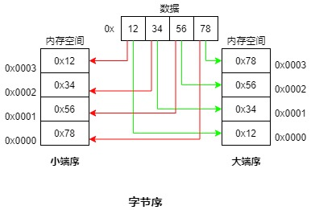

# 目的
学习Socket Internet Domain

# 目录
- [目的](#目的)
- [目录](#目录)
- [Internet domain socket](#internet-domain-socket)
- [网络字节序](#网络字节序)
- [Internet socket地址](#internet-socket地址)
  - [IPv4 socket 地址： struct sockaddr_in](#ipv4-socket-地址-struct-sockaddr_in)
  - [IPv6 socket 地址：struct sockaddr_in6](#ipv6-socket-地址struct-sockaddr_in6)
  - [sockaddr_storage](#sockaddr_storage)
- [主机和服务转换函数概述](#主机和服务转换函数概述)
- [域名系统(DNS)](#域名系统dns)
  - [递归和迭代的解析请求](#递归和迭代的解析请求)
    - [DNS递归名称解析](#dns递归名称解析)
    - [DNS迭代名称解析](#dns迭代名称解析)
  - [顶级域](#顶级域)
- [/etc/services文件](#etcservices文件)
- [独立于协议的主机和服务转换](#独立于协议的主机和服务转换)
  - [getaddrinfo()函数](#getaddrinfo函数)
  - [getnameinfo()函数](#getnameinfo函数)
  - [常见错误](#常见错误)
- [UNIX 与 Internet domain socket比较](#unix-与-internet-domain-socket比较)


# Internet domain socket
Internet domain 流socket基于TCP, Internet domain 数据报socket是基于UDP。 

UDP socket 与之在 UNIX domain 中的对应实体类似， 但有如下差别:
- UNIX domain 数据报socket 是可靠的。 而UDP socket 则是不可靠的， 可能丢失、重复、失序等。
- UNIX domain 数据报socket 在接收socket的数据队列满时发送将会被**阻塞**。 而**UDP在接收队列满时， 将溢出丢弃**。


# 网络字节序
IP地址和端口号是整数值。 将这些值在网络中传输时，因不同硬件结构会以不同的顺序来存储一个多字节整数字节。一般分为**小端**字节序和**大端**字节序。

存储数据时内存低地址处存储数据的最高有效位(比如3210最高有效位为3)则为**大端序**， 相反， 最低位先存储最低有效位称为**小端序**。

如下图所示数据最高有效位为12， 最低有效位为78。


在特定主机上使用的字节序被称为**主机字节序**。 由于端口号和IP地址必须在网络中的所有主机之间传递， 并且需要被它们所理解， 因此必须要使用一个标准字节序。 这种字节序被称为**网络字节序**， 它也是大端字节序。

C中常用的字节序转换函数如下: 

```c
#include <arpa/inet.h>

// 16字节无符号整数， 主机字节序转换为网络字节序
uint16_t htons(uint16_t host_uint16);

// 32字节无符号整数， 主机字节序转换为网络字节序
uint32_t htonl(uint32_t host_uint32);

// 16字节无符号整数， 网络字节序转换为主机字节序
uint16_t ntohs(uint16_t net_uint16);

// 32字节无符号整数， 网络字节序转换为主机字节序
uint32_t ntohl(uint32_t net_uint32);
```

# Internet socket地址

## IPv4 socket 地址： struct sockaddr_in

IPv4 socket地址存储在一个sockcaddr_in结构中， 具体定义如下:

```c
#include <netinet/in.h>

struct in_addr{
    in_addr_t s_addr; // 无符号32位整型
};

struct sockaddr_in{
    sa_family_t     sin_family;  // Address family(AF_INET)
    in_port_t       sin_port;    // Port number
    struct in_addr  sin_addr;    // IPv4 address
    unsigned char   __pad[X];
};

```


## IPv6 socket 地址：struct sockaddr_in6

IPv6地址是128位而不是32位。 一个IPv6 socket 地址会被存储在一个sockaddr_in6结构中。具体如下:
```c
#include <netinet/in.h>

struct in6_addr{
    uint8_t s6_addr[16]; // 16字节 == 128位
}；

struct sockaddr_in6{
    sa_family_t     sin6_family;  // AF_INET6
    in_port_t       sin6_port;
    uint32_t        sin6_flowinfo;
    struct in6_addr sin6_addr;
    uint32_t        sin6_scope_id;
};

```

IPv6 通配地址的C语言常量定义为IN6ADDR_ANY_INIT, 环回地址为 IN6ADDR_LOOPBACK_INIT

## sockaddr_storage
这个结构是即可存储IPv4亦可存储IPv6， 没有版本区分。

# 主机和服务转换函数概述

- ~~`inet_aton()`~~ 与 ~~`inet_ntoa()`~~用于将IPv4地址的二进制与点分十进制之间的转换。
- `inet_pton()` 和 `inet_ntop()` 用于不仅可用于IPv4 的二进制和点分十进制之间的转换， 还可应用与IPv6。
- 如非必要， 尽量避免将IP地址转换为主机名。 因为转换过程涉及到DNS服务的请求过程。
- 避免使用 ~~`gethostbyname()`~~ 与  ~~`getservbyname()`~~ 来返回主机名对应的二进制IP地址与端口号， 因为已过时， 替代方案是使用`getaddrinfo()`。 
- 其他过时接口包括 ~~`gethostbyaddr()`~~ 和 ~~`getservbyport()`~~, 替代现代接口为 `getnameinfo()`


```c
#include <arpa/inet.h>

/**
 * @brief IP地址点分十进制转换为二进制
 * 
 * @param domain  通信的“域”， AF_UNIX、AF_INET、AF_INET6、AF_PACKET(链路层通信)
 * @param src_str 点分十进制IP
 * @param addrptr 输出IP地址的二进制
 * @return int 1 表示成功， 0 或 -1 表示错误。 0 表示格式不正确
 */
int inet_pton(int domain, const char* src_str, void* addrptr);

/**
 * @brief IP二进制转换为点分十进制
 * 
 * @param domain 通信域
 * @param addrptr IP二进制值
 * @param dst_str IP 点分十进制字符串输出
 * @param len dst_str 缓冲区大小
 * @return const char* 成功返回dst_str地址， 否则返回NULL表示出错
 */
const char* inet_ntop(int domain, const void* addrptr, char* dst_str, size_t len);
```

# 域名系统(DNS)
DNS(Domain Name System)是互联网的一项服务， 它作为将域名和IP地址相互映射的一个分布式数据库， 能够使人们很方便地访问互联网。 **DNS使用UDP端口53**。

在DNS出现之前， 主机名和IP地址之间的映射关系是在一个**手工维护的本地文件**`/etc/hosts`中进行定义的。 定义形式大致如下:
```
127.0.0.1       localhost
::1             localhost ip6-localhost ip6-loopback
ff02::1         ip6-allnodes
ff02::2         ip6-allrouters
```

`gethostbyname()`就是通过搜索整个文件并找出与规范主机名或其中一个别名匹配的记录来获取一个IP地址。 然而随着网络主机数量的增长， 这种方式已经变得不太可行。 DNS主要是被设计用来解决整个问题的。

DNS的关键设计思路如下:
- 将主机名组织在一个层级名空间中。 DNS层级中的每个节点都有一个标签(名字)， 该标签**最多包含63个字符**。 层级的根是一个无名字的结点， 即“匿名结点”
- 完全限定域名由.结尾， 如`www.kernel.org.`, 通常被省略
- 一个节点的域名由该节点到根节点的路径中所有结点的名字连接而成，用点(`.`)分隔。
- 存在一个DNS服务器层级， 每台服务器管理树的一个分支(一个区域)。 每个区域都有一个主名字服务器，一个或多个从名字服务器(主名字服务器崩溃时提供备份)。
- 当调用getaddrinfo()时， 依赖一组库函数(resolver库)来与本地DNS服务通信。 如本地服务无法提供所需信息， 则与位于层级中的其他DNS服务器通信以获取信息。 有时候比较耗时， DNS服务器采用了缓存技术来避免在查询常见域名时不必要的通信。

## 递归和迭代的解析请求
递归与迭代的区别在于：DNS客户端和本地名称服务器是递归，而本地名称服务器和其他名称服务器之间是迭代。

### DNS递归名称解析
在DNS递归名称解析中， 当所配置的本地名称服务器解析不了时，后面的查询工作由本地名称服务器替代DNS客户端进行(**以本地名称服务器为中心**)。 只需要本地名称服务器向DNS客户端返回最终查询结果即可。

### DNS迭代名称解析
所有的查询工作都是以DNS客户端自己进行(**以DNS客户端为中心**)。 在以下条件满足时， 则会采用迭代名称解析:
- 查询本地名称服务器时， DNS请求报头字段RD没置为1。即不要求以递归方式查询。 
- DNS请求要求使用递归查询， 即RD置为1时，但配置的本地名称服务器禁用了递归查询(一般支持)，即在应答DNS报文头部的RA字段置为0。

## 顶级域
紧跟在匿名根节点下的节点被称为顶级域(TLD)。以此类推为二级域....。 TLD分为通用的和国家的。

历史上存在七个通用TLD: `com、edu、net、org、int、mil、gov`, 近来添加了: `info、name、museum`。
国家TLD： `de、eu、nz、us`等

# /etc/services文件
该文件记录了众所周知的端口号及其对应的服务名。 getaddrinfo()和getnameinfo()使用这个文件中的信息进行转换。基本格式如下:

```
tcpmux          1/tcp                           # TCP port service multiplexer
tcpmux          1/udp                           # TCP port service multiplexer
rje             5/tcp                           # Remote Job Entry
rje             5/udp                           # Remote Job Entry
echo            7/tcp
echo            7/udp
discard         9/tcp           sink null
discard         9/udp           sink null
systat          11/tcp          users
systat          11/udp          users
```

# 独立于协议的主机和服务转换
`getaddrinfo()`函数用于将主机和服务名转换为IP地址和端口号。 替代~~gethostbyname()~~与 ~~getservbyname()~~;
`getnameinfo()`函数是`getaddrinfo()`的逆函数， 它将一个socket地址结构转换成包含对应主机和服务名的字符串。替代~~gethostbyaddr()~~和~~getservbyport()~~。

这两个方法都是**可重入**的。 且不区分IPv4与IPv6。

## getaddrinfo()函数
给定一个主机名和服务名， getaddrinfo()函数返回一个socket地址结构列表(链表)

```c
#include <sys/socket.h>
#include <netdb.h>

/**
 * @brief 根据主机名和服务名， 返回socket地址结构
 * 
 * @param host 主机名或IPv4地址(点分十进制)或IPv6地址
 * @param service 服务名或十进制端口号
 * @param hints 为返回的socket地址结构作限定， 指定要求
 * @param result 根据hints返回指定socket地址结构
 * @return int 0 表示成功， 非0则表示失败
 */
int getaddrinfo(const char* host, const char* service, const struct addrinfo *hints, struct addrinfo **result);

// 清理由getaddrinfo构造的result所占用的内存
void freeaddrinfo(struct addrinfo *result);
```

[点击查看使用示例](socket_info_transform.c)

## getnameinfo()函数
getnameinfo() 函数是getaddrinfo()的逆函数。给定一个socket地址结构(IPv4或IPv6)， 它返回一个包含独赢主机和服务名的字符串。

```c
#include <sys/socket.h>
#include <netdb.h>

/**
 * @brief 根据socket 地址结构获得其主机名和服务名
 * 
 * @param addr socket 地址结构
 * @param addrlen socket 地址结构长度
 * @param host 返回主机名或IP地址
 * @param hostlen host缓冲区长度
 * @param service 返回服务名或端口号
 * @param servlen service缓冲区长度
 * @param flags 位掩码， 控制着getnameinfo()的行为。
 * @return int 返回0 表示成功， 非0 则失败
 */
int getnameinfo(const struct sockaddr *addr, socklen_t addrlen, char *host, size_t hostlen, char *service, size_t servlen, int flags);
```

[点击查看使用示例](socket_info_transform.c)

## 常见错误
以上接口`getnameinfo()`与`getaddrinfo()`返回值错误常量如下:

| 错误常量       | 描述                                                        |
| :------------- | :---------------------------------------------------------- |
| EAI_ADDRFAMILY | 在hints.ai_family中不存在host的地址                         |
| EAI_AGAIN      | 名字解析过程发生临时错误(稍后重试)                          |
| EAI_FAIL       | 访问名字服务器时发生了无法恢复的故障                        |
| EAI_FAMILY     | 不支持在hints.ai_family中指定的地址族                       |
| EAI_MEMORY     | 内存分配故障                                                |
| EAI_NODATA     | 没有与host关联的地址                                        |
| EAI_OVERFLOW   | 参数缓冲器溢出                                              |
| EAI_SERVICE    | hints.ai_socktype不支持指定的service(仅供getaddrinfo()使用) |
| EAI_SOCKTYPE   | 不支持指定的hints.ai_socktype（仅供getadrinfo()使用）       |
| EAI_SYSTEM     | 通过errno返回系统错误                                       |


根据错误码获取错误描述：
```c
#include <netdb.h>

// 返回错误详情
const char * gai_strerror(int errcode);
```


# UNIX 与 Internet domain socket比较
当编写通过网络进行通信的应用程序时必须要使用Internet domain socket， 当位于同一系统上的应用程序使用socket 进行通信时则可选择Internet或UNIX domain socket。
它们存在以下差异:
- 在一些实现上， UNIX domain socket的速度比Internet domain socket 速度块
- 可以使用目录(或文件) 权限来控制对UNIX domain socket的访问

