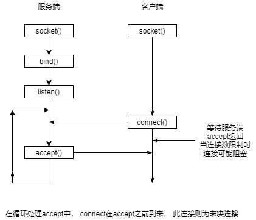
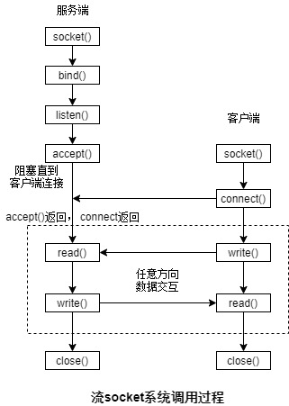
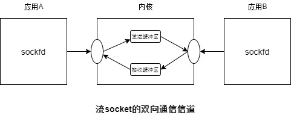
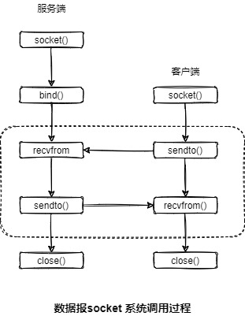

# 目的
学习Linux 套接字编程

# 目录
- [目的](#目的)
- [目录](#目录)
- [Socket概述](#socket概述)
  - [通信domain](#通信domain)
  - [socket 类型](#socket-类型)
- [socket系统调用](#socket系统调用)
  - [创建socket](#创建socket)
  - [socket绑定到地址](#socket绑定到地址)
  - [监听接入连接：listen()](#监听接入连接listen)
  - [接受连接：accept()](#接受连接accept)
  - [连接到socket: connect()](#连接到socket-connect)
  - [发送与接收数据报: recvfrom()与sendto()](#发送与接收数据报-recvfrom与sendto)
  - [终止连接: close()](#终止连接-close)
- [流socket](#流socket)
  - [流socket I/O](#流socket-io)
- [数据报socket](#数据报socket)
  - [在数据报socket上使用connect()](#在数据报socket上使用connect)
- [UNIX DOMAIN](#unix-domain)
  - [UNIX domain socket 地址: struct sockaddr_un](#unix-domain-socket-地址-struct-sockaddr_un)

# Socket概述
socket是一个各应用间允许通信的“设备”

## 通信domain
socket 存在与一个通信domain中， 它可确定:
- 识别出一个socket的方法(即socket"地址"格式)
- 通信范围
  - 同一主机不同进程
  - 不同主机之间的进程

现代操作系统至少支撑如下domain:

| Domain            | 执行的通信 | 应用程序间的通信           | 地址格式                 | 地址结构     |
| ----------------- | ---------- | -------------------------- | ------------------------ | ------------ |
| AF_UNIX(AF_LOCAL) | 内核中     | 同一主机                   | 路径名                   | sockaddr_un  |
| AF_INET           | 通过IPv4   | 通过IPv4网络连接起来的主机 | 32为IPv4地址+16位端口号  | sockaddr_in  |
| AF_INET6          | 通过IPv6   | 通过IPv6网络连接起来的主机 | 128为IPv6地址+16位端口号 | sockaddr_in6 |

## socket 类型

| 特性             | 流(SOCK_STREAM)  | 数据报(SOCK_DGRAM) |
| ---------------- | --- | ------ |
| 是否可靠传输     | 是  | 否     |
| 消息边界是否保留 | 否  | 是     |
| 面向连接         | 是  | 否     |

流socket(SOCK_STREAM)提供了一个可靠的双向的字节流通信信道:
- 可靠的: 可保证发送者传输的数据会完整无缺第到达接收应用程序或收到一个传输失败通知。
- 双向的：表示数据可在两个socket之间任意方向上传输
- 字节流：表示与管道一样不存在详细边界的概念

数据包socket(SOCK_DGRAM)允许数据以被称为数据报的消息的形式进行交换。在数据报socket中消息边界得到了保留， 但数据传输是不可靠的。消息的到达**可能是无需的、重复的或丢失的**。

# socket系统调用
- socket()：创建socket
- bind()： 将socket绑定的一个地址上。
- listen()：允许一个流socket接受来自其他socket的接入连接。
- accept()：在一个监听流socket上接受来自一个对等应用程序的连接。
- connect()：建立与另一个socket之间的连接。

> socket I/O可使用传统的read()和write()系统调用或使用一组socket特有的系统调用(如send()、reccv()、sendto()及recvfrom())来完成。默认情况下这些系统调用在I/O操作时会被阻塞。可使用`fcntl()` `F_SETFL`来启用`O_NONBLOCK`标志便以执行非阻塞I/O.

## 创建socket

```c
#include <sys/socket.h>

/**
 * @brief 创建一个套接字
 * 
 * @param domain 协议族。通信domain. AF_UNIX|AF_INET|AF_INET6
 * @param type socket 类型. SOCK_STREAM|SOCK_DGRAM|SOCK_CLOEXEC|SOCK_NONBLOCK
 * @param protocol 传输协议。通常为0。可指定 IPPROTO_TCP|IPPROTO_UDP....
 * @return int 返回套接字， -1则创建失败
 */
int socket(int domain, int type, int protocol);
```

## socket绑定到地址

```c
#include <sys/socket.h>

/**
 * @brief 将socket绑定到地址
 * 
 * @param sockfd socket
 * @param addr addr地址结构
 * @param addrlen addr长度
 * @return int 0表示成功， -1 则失败
 * @note 通常服务端调用
 */
int bind(int sockfd, const struct sockaddr* addr, socklen_t addrlen);
```

## 监听接入连接：listen()

```c
#include <sys/socket.h>

/**
 * @brief 将文件描述符sockfd引用的流socket标记为被动。 这个socket用来接受来自其他socket的连接
 * 
 * @param sockfd socket
 * @param backlog 可接受未决连接数的数量
 * @return int 返回0表示成功， -1则出错
 */
int listen(int sockfd, int backlog);
```

理解参数`backlog`:



## 接受连接：accept()

`accept()`系统调用接受一个接入连接，如果存在`未决的连接`, 那么调用立即返回, 否则等待。

```c
#include <sys/socket.h>

/**
 * @brief 在listen流socket上接受一个接入连接
 * 
 * @param sockfd listen流socket
 * @param addr 用以返回对端地址的结构
 * @param addrlen addr的长度， 返回实际sa_data大小
 * @return int 返回socket文件描述符， -1 则表示出错
 */
int accept(int sockfd, struct sockaddr * addr, socklen_t * addrlen);
```

`accept()`会创建一个新已连接的socket， 这个新的socket用以与执行connect()的对等socket进行连接。
accept() 还会返回对端的socket地址， 如果不需要可将addr和addrlen设置为NULL和0。可在稍后调用`getpeername()`来获取对端地址。

## 连接到socket: connect()

```c
#include <sys/socket.h>

/**
 * @brief 将文件描述符sockfd对应的socket连接到在地址addr监听的socket上
 * 
 * @param sockfd socket
 * @param addr 服务端的地址
 * @param addrlen addr 长度
 * @return int 成功则返回0， 否则返回-1
 */
int connect(int sockfd, const struct sockaddr* addr, socklen_t addrlen);
```

## 发送与接收数据报: recvfrom()与sendto()

```c
#include <sys/socket.h>

/**
 * @brief 从对端socket中接收数据
 * 
 * @param sockfd 本端socket
 * @param buffer 接收数据的buffer
 * @param length 数据长度(字节数)
 * @param flags 位掩码
 * @param src_addr 对端socket地址
 * @param addrlen src_addr 长度, 返回实际写入结构的字节数
 * @return ssize_t 返回实际收到的字节数， 0表示EOF， -1 表示错误
 * @note 可用read()替代， 相当于不关心数据来源。
 *  
 */
ssize_t recvfrom(int sockfd, void* buffer, size_t length, int flags, struct sockaddr* src_addr, socklen_t* addrlen);


/**
 * @brief 发送数据到指定socket地址
 * 
 * @param sockfd 本端socket
 * @param buffer 发送数据buffer
 * @param length 发送数据长度
 * @param flags 位掩码
 * @param dest_addr 对端socket地址
 * @param addrlen dest_addr长度
 * @return ssize_t 返回实际发送的字节数， -1则表示出错
 */
ssize_t sendto(int sockfd, const void* buffer, size_t length, int flags, const struct sockaddr* dest_addr, socklen_t addrlen);
```

`recvfrom()`只会从数据报中读取一条消息， 如果消息大小超过了length字节， 那么消息将会被截断为length字节。


## 终止连接: close()
终止一个流socket连接的常见方式是调用close()。如果**多个文件描述符引用了同一个socket, 那么当所有文件描述符被关闭后连接才会终止**。


# 流socket

流socket与电话系统类似
1. socket()系统调用创建一个socket， 等价于安装一个电话。 为使两个应用程序能够通信， 每个应用程序必须要创建一个socket。
2. 通过一个流socket通信类似于一个电话呼叫。 一个应用程序通信前必须将其socket连接到另一个应用程序的socket上。 基本过程如下：
   1. 一个应用调用bind()将socket绑定到一个总所周知的地址上， 然后调用listen() 通知内核它接受接入连接的意愿。 类似有个总所周知的电话， 确保打开了。
   2. 其他应用通过connect()建立连接， 同时需指定连接的socket地址。 类似拨某人电话号码
   3. 调用listen()的程序使用accept()接受连接。 类似电话响起时拿起雕花。 
3. 一旦建立连接后， 可在程序之间双向传递数据。 直到其中一个使用close()关闭连接为止。




## 流socket I/O

流I/O与管道I/O类似，** 试图向一个关闭的socket写入数据， 会收到`SIGPIPE`信号， 系统调用返回错误EPIPE**。试图向一个关闭的socket读取数据会收到文件结束(当所有缓冲数据都被读取之后)



# 数据报socket
数据包socket 的运作类似于邮政系统。
1. `socket()`等价于创建一个邮箱。 需要发送和接收数据报的应用都需使用socket()创建一个数据包socket;
2. 为允许socket能接收数据报， 需要将其`bind()`到一个众所周知的地址上。通常服务端程序会将socket绑定到一个总所周知的地址上。在某些domain(UNIX domain)中， 客户端若想收到来自服务器的数据报，也需要将socket利用`bind()`与地址绑定。
3. 利用 [sendto()](#发送与接收数据报-recvfrom与sendto) 发送数据报 。
4. 利用 [recvfrom()](#发送与接收数据报-recvfrom与sendto) 接收数据报。在没有数据报到达时会阻塞。
5. `close()` 关闭socket



## 在数据报socket上使用connect()
如果对一个数据报socket调用`connect()`, 相当于将本端socket与对端socket建立“对”, 往后的发送与接收数据将默认为与对端socket进行通信。 而无需再指定socket地址。

> 利用`connect`建立起来的数据报socket对， 并非对称的。 "对"仅相对于调用`connect`这一端而言。而对端未必与本端唯一绑定。

再次调用`connect()` 可修改已连接的数据报socket"对"。而指定domain为 `AF_UNSPEC`可解除对等关联关系(并没每个UNIX实现都支持)。

# UNIX DOMAIN
UNIX domain socket主要用于同一主机系统上进程间的相互通信

## UNIX domain socket 地址: struct sockaddr_un
为将一个UNIX domain socket 绑定到一个地址上， 需要初始化一个`sockaddr_un`结构。
```c
struct sockaddr_un{
  sa_family_t sun_family; // 总是 AF_UNIX
  char sun_path[108];
};
```

以下为调用示例， 将UNIX domain绑定到一个地址上:
```c
const char* const SOCKNAME="/tmp/mysock";
struct sockaddr_un addr;
memset(&addr, 0, sizeof(struct sockaddr_un));
addr.sun_family = AF_UNIX;
strncpy(addr.sun_path, SOCKNAME, sizeof(addr.sun_path) - 1);
if (-1 == bind(sockfd, (struct sockaddr*)&addr, sizeof (struct sockaddr_un))){
    return EXIT_FAILURE;
}
```

当用来绑定UNIX domain socket时， bind()会在文件系统中创建一个条目。这个文件被标记为socket。当使用stat()时， stat结构的st_mode字段的文件类型为S_IFSOCK。 当使用 `ls -l`列出时， UNIX domain socket在第一列会显示类型s， 而`ls -F`会在socket路径后面附加一个等号(=)

> 尽管UNIX socket socket 是通过路径名标识， 当这些socket发生的I/O无须对底层设备进行操作。

**注意事项:**
- 无法将socket绑定到一个既有的路径上， 否则失败返回**EADDRINUSE**
- 一个socket 只能绑定到一个路径上， 反之亦然
- 无法使用open()打开一个socket
- 当不再使用socket时，可使用`unlink()`或`remove()`删除其路径名


