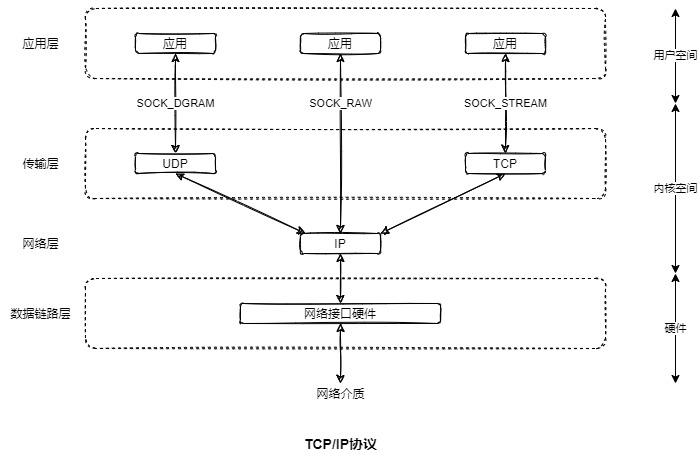
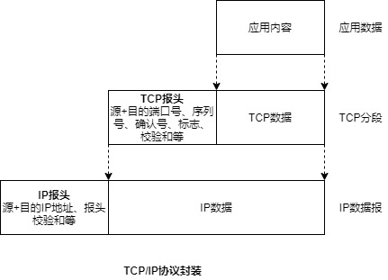
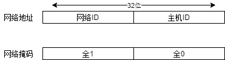
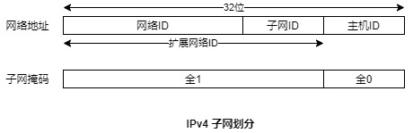
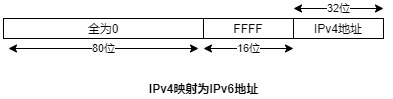
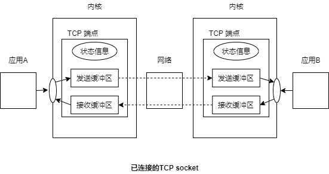

# 目的
学习SOCKET: TCP/IP网络基础

# 目录
- [目的](#目的)
- [目录](#目录)
- [互联网及其协议与层](#互联网及其协议与层)
  - [协议](#协议)
  - [封装](#封装)
- [数据链路层](#数据链路层)
- [网络层: IP](#网络层-ip)
  - [IP传输数据报](#ip传输数据报)
  - [IP 是无连接和不可靠的](#ip-是无连接和不可靠的)
  - [IP可能会对数据进行分段](#ip可能会对数据进行分段)
- [IP地址](#ip地址)
  - [IPv4地址](#ipv4地址)
    - [子网](#子网)
  - [IPv6地址](#ipv6地址)
- [传输层](#传输层)
  - [端口号](#端口号)
    - [总所周知、注册的以及特权端口](#总所周知注册的以及特权端口)
    - [临时端口](#临时端口)
  - [用户数据报协议（UDP）](#用户数据报协议udp)
    - [选择一个UDP数据报大小以避免IP分段](#选择一个udp数据报大小以避免ip分段)
  - [传输控制协议(TCP)](#传输控制协议tcp)
    - [连接建立](#连接建立)
    - [将数据打包成段](#将数据打包成段)
    - [确认、重传以及超时](#确认重传以及超时)
    - [排序](#排序)
    - [流量控制](#流量控制)
    - [拥塞控制: 慢启动和拥塞避免算法](#拥塞控制-慢启动和拥塞避免算法)

# 互联网及其协议与层
互联网络(internetwork)或互联网(internet, **小写i**)会将不同计算机用网络连接起来实现相互通信。互联网是由计算机网络组成的网络。 术语子网络或子网， 用了指组成因特网的其中一个网络。

TCP/IP为使用最为广泛的互联网互联协议，术语Internet(**大写I**)被用来指将全球成千上万的计算机连接起来的TCP/IP互联网。

## 协议
一个联网协议是定义如何在一个网络上传输信息的一组规则。 联网协议通常会被组织成一系列的层， 其中每一层都构建于下层之上并提供特性以供上层使用。

TCP/IP协议套件是一个分层联网协议， 它包括因特网协议(IP)和位于其上层的各个协议层。实现这些层的代码通常被称为**协议栈**。
**TCP/IP**是从传输控制协议(TCP)是使用最广泛的传输协议的事实而得出。

> 协议分层如此强大和灵活的一个重要原因是每个协议层都对上层隐藏下层的操作和复杂些。

## 封装

封装是分层联网协议中的一个重要原则。 封装的关键概念是低层不会将高层向低层传递的信息进行任何处理， 而只是附加本层数据，然后传递到下一层。





# 数据链路层

数据链路层由设备驱动和底层物理媒介(电话线、或光纤)的硬件接口(网卡)构成。

数据链路层需要将网络层传递的数据报封装成为帧进行传输。每个帧包含一个头，头中包含目标地址和帧的大小。这一层可能会进行错误检测、重传以及流量控制。

> 应用程序无需关心数据链路层， 因为链路层所有通信细节由驱动和硬件来处理。

数据链路层中比较重要的一个特点是**最大传输单元(MTU)**。其大小为传输的**帧大小的上限**。 不同的数据链路层的MTU是不同的(路径MTU)。

以下命令可查看系统中网络接口的MTU大小：
```shell
netstat -i
```

# 网络层: IP
网络层关注将数据包从源主机发送到目标主机。 主要包括如下步骤：
- 将数据分解成足够小的片段便于在数据链路层进行传输
- 在因特网上路由数据
- 为传输层提供服务

在TCP/IP中， 网络层主要协议为IP。 包括:
- IPv4: 32位地址
- IPv6: 128位地址

一个裸体socket(**SOCK_RAW**)允许应用直接与IP层进行通信(而不经过传输层)。

## IP传输数据报
IP以数据报的形式来传输数据。 一个IP数据报包含一个头， 其大小范围为20~60字节。 头中包含目标主机地址及源主机地址。

> 发送主机可以伪造一个包的源地址，  这也是SYN泛洪实现的基础

IP的实现中其数据报大小存在一个上限。 其大小至少与规定的IP最小重组缓冲区大小一样大。 **IPv4中限制值为576字节， IPv6中为1500字节。**

## IP 是无连接和不可靠的
IP是一种无连接协议， 未为两个主机之间提供一个虚拟电路。 同时， IP也是一种不可靠协议: 它尽力而为地将数据报从发送者送往接收者。 **不保证达到顺序， 不保证不重复， 不保证一定会到达。** IP没提供错误恢复，头信息错误包直接被丢弃。

> IPv4为IP头部提供了校验和， 用以检测头中错误。 **但并未对包中的数据提供错误检测**。 IPv6并未为IP头提供校验和， 需依靠高层协议来完成。
> 
> UDP校验和在IPv4中是可选的， 一般都是启用的， 而在IPv6中是强制的。 TCP校验和在IPv4和IPv6中都是强制的。

## IP可能会对数据进行分段
IPv4数据报最大大小为65535字节。 默认情况下IPv6的数据报大小为65575(40字节存储头信息， 65535字节用于存储数据)。

前面提到过链路层存在一个数据帧大小上限(MTU)。 在常见的以太网中其大小为1500字节(远小于IP数据报最大大小)。 
IP还定义了**路径MTU**概念：即从源主机到目的主机之间路由上所有数据链路层的最小MTU。

当IP数据报大小大于MTU时， IP会将数据报分段成适合在网络上传输的单元。最终到达目的主机后再重组数据报。

> 由于IP并不进行重传， 且只有当所有分段都到达目的地之后才能对数据报进行组装， 若一些分段丢失或包含传输错误的话就会导致整个数据报不可用。 从而导致较高的丢失率。 在TCP中采用了**路径MTU发现**算法， 来确定主机之间的一条路径MTU, 并根据该值对传递给IP的数据进行分解， 因此IP就不会对数据报进行分段处理。

# IP地址

一个IP地址包括两个部分: 一个是网络ID， 它指定了主机所属网络； 另一个是主机ID, 它标识出了位于该网络的主机。

## IPv4地址
一个IPv4地址包含32位。 通常以点分十进制标记法，即将4个字节分别写成一个十进制数字，以点号分隔。如: 192.168.0.111。

如下图所示， 利用**网络掩码**很容易地区分了地址中的网络部分及其主机部分。比特为1的部分即位网络部分， 为0则为主机部分。


另一种表示方法为如下所示:
```shell
192.168.0.111/24
```
**其中的/24表示掩码从左至右多少个bit位是1**。点分十进制表示则为: 255.255.255.0

管理员可分配254个地址给计算机， 范围为192.168.0.1 ~ 192.168.0.254。 **第一个和最后一个地址不能分配给使用者**。 其中 192.168.0.0，主机bit位都为0， 用以标识网络本身， 另一个地址的主机bit位都是1(192.168.0.255),它是子网广播地址。

另外特殊地址**127.0.0.1**为**环回地址**， 通常分配给主机名**localhost**。 发送到这个地址的数据报不会到达网络，它在内核中环回为输入。 在C程序中用宏**INADDR_LOOPBACK**表示。

而**INADDR_ANY**作为IPv4的通配地址。通配IP地址对于Internet domain socket绑定到多宿主机(多个网卡)上的应用程序来说比较有用。 意味着将接收任意一个主机(网卡)的数据报和连接请求， 否则绑定的固定IP，将只能接收来自这个主机的数据报。

### 子网
将一个IPv4地址的主机ID部分分成两部分: **子网ID和主机ID**。
通常而言， 管理元会开启一组子网来构建一个内部互联网， 每个子网使用网络ID和子网ID组合起来标识。 这种组合通常被称为**扩展网络ID**。



## IPv6地址

IPv6地址原理与IPv4地址是类似的。 差别在于IPv6地址由128位构成。 表示方法为**每16位用冒号隔开的十六进制数字**， 如下:

```shell
F000:0:0:0:0:0:A:1
```
对于0的位， 可以用双冒号替代， 以上地址可简写为:
```shell
F0000::A:1
```

而IPv6的环回地址是127个0最后一个1， 即`::1`。通配地址都为0， 用`::`表示。

IPv4可映射为IPv6，当期与IPv4主机通讯时用到:


另可表示为`::FFFF:192.168.0.101`

# 传输层

在TCP/IP中使用广泛的两个传输层协议如下:
- 用户数据报协议(UDP)
- 传输控制协议(TCP)

## 端口号

传输层协议的任务是向位于不同主机上的应用程序提供端到端的服务。 那如何标识应用程序呢？ 在TCP和UDP中， 用一个16位端口号来标识。

### 总所周知、注册的以及特权端口
众所周知的端口号位于**0~1023**之间。 如ssh(安全的shell)的端口号为22， HTTP的端口号为80。它由中央授权机构互联网号码分配局(IANA)分配。 该机构还记录着**注册端口**， 其范围为 **1024~41951**

在大多数TCP/IP实现中， 范围在0~1023之间的端口号也是特权端口号。 意味着只有特权进程(**CAP_NET_BIND_SERVICE**)可以绑定到这些端口上。 `从而防止普通用户通过实现恶意程序(如伪造ssh)来获取密码`。

### 临时端口
一般临时端口号位于 49152~65535之间。 当客户端程序**未调用bind()**来绑定端口， 此时TCP和UDP会为该socket分配一个临时端口。 另外TCP和UDP将socket绑定到**端口0上时也会分配一个临时端口**。

## 用户数据报协议（UDP）
UDP 仅仅在IP之上添加两个特性: 端口号和一个进行检测传输数据错误的数据校验和。**UDP是无连接的、不可靠的**。

> UDP和TCP使用的校验和长度只有16位， 且只有简单的“总结性”校验和。 阴恻无法检测出特定的错误，其结果是无法提供较强的错误检测机制。 
> 
> 安全的sockets层(**Secure Sockets Layer, SSL**)提供了安全通信即更加严格的错误检测过程。

### 选择一个UDP数据报大小以避免IP分段
若使用UDP时传输的数据报大小超过了本地数据链路的MTU, 那么就很容易导致IP分段。 应尽量避免IP分段，降低IP数据报的丢失率。

由于UDP不知道源主机与目的主机之间的路径MTU。 所以采用保守的方法避免IP分段。**即确保传输的IP数据报大小小于IPv4的组装缓冲区大小的最小值576字节**。 这576字节中， 8个字节用于存放UDP头， 另外需要至少20个字节存放IP头， 剩下的**548字节**用于存放UDP数据本身。 在实践中， 一般使用**512字节**来存放数据报本身。


## 传输控制协议(TCP)
TCP在两个端点(应用程序)之间提供了可靠的、面向连接的、双向字节流通信信道。



### 连接建立
TCP需在两个端点之间建立一个通信信道。 在连接期间发送者和接收者需要交换选项来协商通信参数。

### 将数据打包成段
数据会被分解成段， 每个段包含一个校验和，用来检测端到端的传输错误。 每个段使用单个IP数据报来传输。

### 确认、重传以及超时
当一个TCP段无错地达到目的地时，接收TCP会向发送者回复一个确认。 如果数据段出错或丢失， 确认信息也不会被发送。发送者为应对数据丢失或出错的情况， 需要开启一个定时器， 若超时未收到确认， 则重发数据段。

### 排序

在TCP连接上传输的每一个字节都会分配到一个逻辑序号。这个序号指出了该字节在这个连接的数据流中所处的位置。数据段的序号主要作用如下:
- 保证数据段有序在目的地组装， 然后以字节流形式传递给应用层。
- 反馈发送者
- 去除重发分段。 重复分段可能因为IP数据报重复， 也可能是TCP本身重传导致。

### 流量控制

**流量控制防止一个快速的发送者将一个慢速的接收者压垮**。

实现流量控制的关键在于接收端需要维护一个缓冲区。(TCP连接阶段会通告其缓冲区大小)。 当接收到数据会累积在这个缓冲区中， 当应用程序读取数据会从缓冲区中删除数据。 每个确认中， 接收者会通知发送者缓冲区可用空间(剩余字节)。

TCP流量控制采用了**滑动窗口算法**，它允许包含总共N字节(窗口大小)的未确认段， 同时在发送者和接收者之间传输。 如果接收端缓冲区满， 窗口就会被关闭， 发送TCP就会停止传输数据

> 接收者可使用SO_RCVBUF 来设置socket接收缓冲区大小

### 拥塞控制: 慢启动和拥塞避免算法
TCP 拥塞控制算法被设计用来防止快速的发送者压垮整个网络。 如果一个发送TCP发包速度快于一个中间路由器转发速度， 那么路由器就会开始丢弃包。 将导致较高的丢包率， 其结果是如果TCP保持以相同的速度发送这些丢弃的分段的话就会降低性能。  

TCP拥塞算法用在以下两个场景中比较重要:
- 在连接建立之后(或当传输在一个已经空闲了一段时间的连接上恢复时):  发送者可以立即向网络中注入尽可能多的分段， 只要接收者公告的窗口大小允许即可(这是早期TCP的做法)。这里的问题在于如果网络无法处理这种分段洪泛， 那么发送者会存在立即压垮整个网络的风险。
- 当拥塞被检测到时: 如果发送TCP检测到发生了拥塞， 那么它就必须要降低其传输速率。 `TCP是根据分段丢失来检测是否发生了拥塞， 因为传输错误率是非常低的， 即如果一个包丢失了， 那么就认为发生了拥塞`。
  
TCP 的拥塞控制策略组合采用了两种算法: **慢启动和拥塞避免**。

慢启动算法会使发送TCP在一开始的时候以低速传输数据段， 但同时允许它以指数级速度提高其速率， 只要这些数据段得到了接收TCP的确认。 慢启动能够防止一个快速TCP发送者压垮整个网络。 TCP拥塞避免算法用来防止速率增长过快。 

在连接建立初期， 发送TCP会使用一个较小的拥塞窗口， 它会限制所能传输的未确认数据的数量。当发送者收到数据确认时， 拥塞窗口会呈现指数级增长。 当拥塞窗口增长到一个被认为接近网络传输容量的阈值时， 其增长速度就会变成线性， 而不是指数级。 在任何时刻， 发送TCP传输的数据还会收到接收TCP的通告窗口和本地TCP发送缓冲区大小的限制。

慢启动和拥塞避免算法组合起来使得发送者可以快速讲传输速度提升至网络可用容量。 这些算法允许数据传输快速达到一个平衡状态。 


